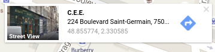
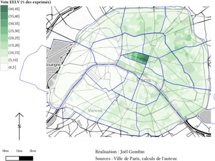
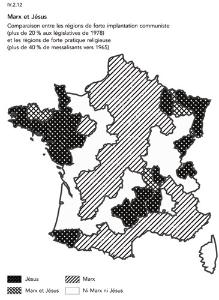

# Introduction à la cartographie - 1
Joël Gombin  
2/2/2016  

# Éléments de cartographie 

## Qu'est-ce qu'une carte ? 

"Une carte est une représentation géométrique plane simplifiée et conventionnelle de tout ou partie de la surface terrestre, et cela dans un rapport de similitude convenable qu'on appelle échelle." (F. Joly, 1976)

Référence : [Béguin et Pumain, 2014 (3e éd.)](http://www.persee.fr/web/revues/home/prescript/article/espos_0755-7809_1998_num_16_1_1827_t1_0119_0000_2)

## La notion de projection 

La projection est l'outil mathématique qui permet de passer du géoïde représentant la Terre à une représentation plane. 

Projections conformes (Mercator, Lambert) ou équivalentes (Eckert IV, Gall). Il y a toujours une déformation !

Les coordonnées géographiques sont exprimées en longitude et latitude. Les unités peuvent être des degrés ou des grades. La projection transforme les coordonnées géographiques en coordonnées x/y. 

Exemple de coordonnées géographiques :

Un [truc cool pour jouer avec les différentes projections](http://bl.ocks.org/mbostock/raw/3711652).

_The West Wing_, la série qui arrive à faire un sketch drôle sur les projections géographiques :

<iframe width="560" height="315" src="http://www.youtube.com/embed/vVX-PrBRtTY" frameborder="0" allowfullscreen></iframe>

## L'échelle 

L'échelle d'une carte représente le rapport d'une distance mesurée sur la carte à sa valeur réelle sur le terrain.

Échelle        | 1 cm représente
---------------|----------------
1/10000        |100 m
1/25000        |250m
1/50000        |500m
1/100000       |1km
1/1000000      |10km

Attention : "petite échelle" = grande superficie représentée
"grande échelle" = petite superficie représentée

L'échelle est déformée à distance du centre de projection (équateur pour Mercator)

Échelle numérique et échelle graphique :

## La généralisation 

"L'opération qui par sélection, schématisation et harmonisation reconstitue sur une carte la réalité de la surface représentée dans ses traits essentiels en fonction du but de la carte, de son thème, de son échelle et des particularités de la région cartographiée."

## La sélection 

Quelles couches d'information représenter ? Ni trop (surcharge d'information, à la Google Maps) ni trop peu (rendre la carte intelligible au lecteur).

Le [style "toner"](http://maps.stamen.com/toner/#12/37.7706/-122.3782) peut être utile pour trouver cet équilibre, en cartographie thématique :

## La schématisation 

Opération de simplification, qui peut être structurale (tracés) ou conceptuelle (schéma). 

Attention : on peut simplifier à partir de données détaillées, mais on ne peut pas faire l'inverse ! Donc toujours veiller à conserver les données dans leur forme la plus détaillée. 

## Le fond de carte 

Le fond de carte est constitué des éléments repris d'une carte topographique (par exemple de l'IGN) et utilisés pour une carte thématique.

"Carte reproduite totalement ou partiellement, en une ou plusieurs couleurs souvent atténuées, servant de repère pour le report en surcharge de phénomènes localisables déterminés" (CFC). Peut concerner les découpages administratifs, le réseau routier, hydrographique, les courbes de niveau, etc. 

## Les sources de fonds de carte 

Traditionnellement, en France : l'IGN.

De plus en plus : Google Maps, Open Street Map, Stamen...

Avec des fonds de carte sympas, en style toner :

<iframe src='http://maps.stamen.com/toner/#12/48.8974/2.2017' width='1000' height='800'></iframe>

ou encore aquarelle :

<iframe src='http://maps.stamen.com/watercolor/#12/48.8974/2.2017' width='1000' height='800'></iframe>

## Vecteur ou raster 

Comment stocker et représenter l'information géographique ?

- "Mode raster" : il s'agit d'une image, découpée en pixels. Des valeurs sont attribués aux pixels. Ex : photo satellite.

- "Mode vecteur" : on utilise des objets géométriques (lignes, points, polygones...) auxquels sont associés des attributs. Ex : carte d'un réseau de transports.

OpenStreetMap, par exemple, fournit des données en vectoriel : 

<iframe width="1000" height="800" frameborder="0" scrolling="no" marginheight="0" marginwidth="0" src="http://www.openstreetmap.org/export/embed.html?bbox=2.3314136266708374%2C48.866987337550164%2C2.33908474445343%2C48.87019135286425&amp;layer=transportmap" style="border: 1px solid black"></iframe>

Ces données vectorielles sont (plus ou moins facilement) requêtables : voir par exemple http://overpass-turbo.eu/s/e7X/. Il existe (évidemment !) [un package R](https://github.com/hrbrmstr/overpass) pour ce faire.

Un exemple de carte en raster :

<iframe src='http://www.comeetie.fr/galerie/francepixels/#' width="1000" height="800"></iframe> <small><a href="http://www.comeetie.fr/galerie/francepixels/#">Voir la source</a></small>

## Cartes choroplèthes 

Une carte choroplèthe est une carte thématique où les régions sont colorées ou remplies d'un motif qui montre une mesure statistique, tels la densité de population ou le revenu par habitant. Ce type de carte facilite la comparaison d'une mesure statistique d'une région à l'autre ou montre la variabilité de celle-ci pour une région donnée.

## Cartes en anamorphose ou cartogramme 

"La cartographie en anamorphose a pour but d'adapter la forme de la carte non pas à la réalité physique mais plutôt à la réalité perçue." [(Langlois et Denain, 1996)](http://cybergeo.revues.org/129) 

On déforme le fond de carte en fonction d'une variable quantitative (voire arbitrairement).

<iframe src='http://prag.ma/code/d3-cartogram/?segmentized#intlmig/2010' width='1000' height='800'></iframe> <small><a href="http://prag.ma/code/d3-cartogram/?segmentized#intlmig/2010">Voir la source</a></small>

Un exemple de votre serviteur : 

## Le langage cartographique 

[Bertin, 1965](http://classiques.uqac.ca/collection_methodologie/bertin_jacques/representations_visuelles_info/representations_visuelles_info_texte.html) : travail sur la sémiologie graphique. La carte, comme le graphique, permettent de percevoir *en même temps* trois informations (X,Y,Z).

Mais pour que cette communication soit efficace, il faut respecter un langage précis et ses règles. 

## Les composantes du langage cartographique 

- les signes graphiques élémentaires : point, trait, tâche (aplat). 
- le figuré cartographique : combinaison de signes graphiques élémentaires.
- l'implantation graphique : manière d'appliquer le figuré sur la carte (ponctuelle, linéaire ou zonale).
- les variables visuelles : façon de faire varier les signes graphiques. Il y en a sept.

## Les variables visuelles 

- forme
- taille
- couleur 
- valeur 
- orientation
- texture-structure (trame)
- grain

## La forme 

- Ne transcrit qu'une information qualitative. 
- Veiller à ne pas utiliser trop de formes différentes, sinon cela devient illisible (< 10)
- Utilisée dans les trois types d'implantation graphique. En implantation zonale => texture.

## La taille 

- longueur/hauteur/surface/volume
- bonne perception visuelle par l'œil
- rapport de proportionnalité entre information quantitative représentée et la forme
- attention à respecter cette proportionnalité ! 
- la taille est plus facile à estimer que la surface ou le volume

Un exemple d'utilisation incorrecte (non-proportionnelle) de la taille :

## La taille 

- Le cartogramme (anamorphose) comme cas particulier de l'utilisation de la taille.
- [Créer un fonds de carte en anamorphose](http://scapetoad.choros.ch/)
- [Réaliser un cartogramme en javascript](http://prag.ma/code/d3-cartogram/)

## La couleur 

* fort pouvoir différentiel
* esthétique
* trois propriétés :
    + ton 
    + saturation
    + intensité
  
## La couleur

<iframe src='http://hslpicker.com/' width='800px' height='500px'></iframe>

## La couleur

- En général, on utilise un seul ton et on joue sur l'intensité.

<iframe src='http://www.joelgombin.fr/municipales2014/grenobleAbstention.html' width='700px' height='600px'></iframe>

## La couleur

- Parfois, par exemple pour représenter une variation, on peut jouer sur deux échelles de tons

<iframe src='http://www.joelgombin.fr/municipales2014/amiensProgFN.html' width='700px' height='600px'></iframe>

## La couleur

- Si on représente une variable qualitative, on utilise autant de tons que de catégories

<iframe src='http://joelgombin.fr/comm.couleur.html' width='1000px' height='700px'></iframe>

## La couleur 

- Penser aux daltoniens !
- Penser au support (web, papier...)
- Des palettes de couleur de référence : [colorbrewer2.org](http://colorbrewer2.org/) par exemple
- Un autre outil de construction de palette de couleur : [vis4.net/labs/multihue](https://vis4.net/labs/multihue/)
- C'est la variable qu'on utilise le plus en cartographie thématique.

## La valeur 

- Valeur : rapport entre quantités totales de noir et de blanc perçues dans une surface donnée (cf. aussi "gris typographique"). 
- Peut passer par une trame 
- Peut concerner une couleur (un ton)
- En général, on utilise des classes (max 6/7)
- Mais parfois, coloration continue

Un exemple de coloration continue :

Des cartes _old school_ de densité, qui utilisent une trame :

Une autre coloration continue (pas très lisible parce qu'elle utilise trop de teintes [hues]) :

## Le grain 

- agrandissement ou réduction d'une texture/structure
- pas très utilisé, car mal perçu par l'œil humain

## L'orientation 

- Angle d'un figuré linéaire
- Pour variable qualitative, moins utilisé aujourd'hui

Un exemple d'utilisation par Todd et Le Bras :

## Distribution et découpage en classes des variables quantitatives 

- discrétisation : découper une variable continue en classes
- ce découpage n'est pas neutre, et ne peut être décidé indépendamment de la distribution de la variable représentée

## Distribution et découpage en classes des variables quantitatives 

Voir [cet article](http://www.persee.fr/web/revues/home/prescript/article/espos_0755-7809_2000_num_18_1_1930)

Un moyen sympa de jouer avec les différentes méthodes de discrétisation :

<iframe src='http://franceo3.geoclip.fr/index.php?profil=FV#z=-349737,6562730,1033057,513716;l=fr;i=euro14.pt_lfn;v=map12' width='1000px' height='800px'></iframe> <small><a href='http://franceo3.geoclip.fr/index.php?profil=FV#z=-349737,6562730,1033057,513716;l=fr;i=euro14.pt_lfn;v=map12'>Voir la source</a></small>

## Et concrètement, on fait comment ?

De très nombreux outils existent. QGIS est en train de s'imposer comme le SIG de référence dans le monde du libre. Malheureusement, en cartographie pure, aucune solution de référence ne permet de traiter aisément tous les cas de figure (vectoriel/raster ; print/web, etc.). En ce qui concerne la carto web, pas vraiment de solution de référence pour l'heure. 

R n'est pas fait (du tout) au départ pour faire de la carto, mais offre aujourd'hui un _workflow_ complet allant du nettoyage des données à leur représentation cartographique en passant par le nettoyage, l'analyse et la transformation des données.

