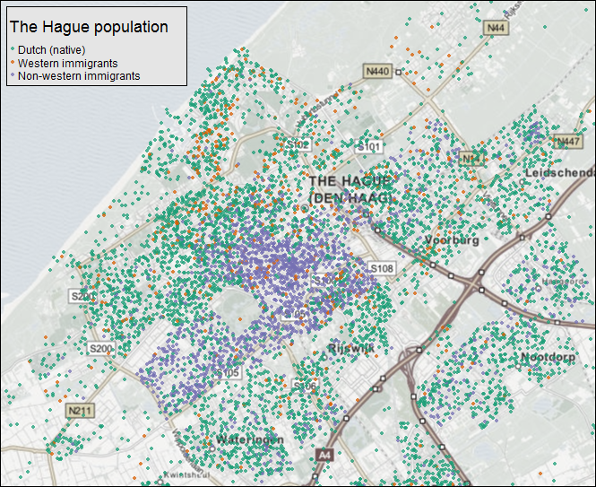

# Rappels sur l'utilisation de R pour le *data management*

# Gestion des objets spatiaux dans R

## Un objet spatial, c'est quoi ?

- une collection de géométries (points, lignes, polygones), regroupées en couches (layers)
- une table attributaire (des données)
- un identifiant unique pour faire le lien entre les deux !
- si les choses sont bien faites, une projection.

## Formats spatiaux

- le plus répandu, la référence : le shapefile (format défini par ESRI). Pose pas mal de problèmes : plusieurs fichiers (.shp, .dbf., .prj, .shx, etc.) ; nom des variables limité à 10 caractères ; pas de valeurs manquantes ; pas plus de 255 variables ; pas de fichiers de plus de 2GB ; format propriétaire...
- le format promu par Google : le [KML](https://developers.google.com/kml/)
- le nouveau standard de facto en ligne : [GeoJSON](http://geojson.org/)
- une version améliorée et topologique du GeoJSON : le [topoJSON](https://github.com/mbostock/topojson)
- etc. etc. 

Il existe des outils libres pour passer d'un format à l'autre, en particulier [OGR/GDAL](http://www.gdal.org/). R possède des [surcouches de ces librairies](https://cran.r-project.org/web/packages/rgdal/index.html). 

## Et dans R ?

Plusieurs classes dans R pour représenter les objets spatiaux. La plus importante (et la seule qu'on utilisera) provient de la librairie `sp` et est `SpatialPolygonsDataFrame` (il existe aussi `SpatialPoints*` et `SpatialLines*`). 

On peut créer un objet `SpatialPolygonsDataFrame` à la main, mais en réalité on ne le fait jamais, on importe un shapefile (ou autre) dans R. Plusieurs fonctions pour cela ; la meilleure est `readOGR`, dans le package `rgdal`.

```{r message=FALSE, warning=FALSE}
#install.packages("sp")
#install.packages("rgdal")

library(sp)
library(rgdal)

departements <- readOGR("./data/departements", "DEPARTEMENT", stringsAsFactors = FALSE)
summary(departements)
```

Les objets `SpatialPolygonsDataFrame` sont complexes, mais comprennent pour simplifier d'une part les polygones (auxquels on accède directement : `departements[1,]`) et d'autre part le `dataframe`, qui est un `slot` de l'objet :

```{r message=FALSE, warning=FALSE}
summary(departements@data)
library(dplyr)
departements@data %>%
  filter(NOM_REGION %in% "ILE-DE-FRANCE")
```

On peut ainsi sélectionner une partie seulement d'un `SpatialPolygonsDataFrame`, en fonction de données de la table attributaire. Malheureusement, on ne peut (pour l'instant ?) utiliser la syntaxe de `dplyr`, mais on peut en revanche utiliser la fonction `subset`, avec une syntaxe proche (sauf qu'on sélectionne les lignes et, le cas échéant, les colonnes de la table attributaire dans la fonction `subset`).

```{r message=FALSE, warning=FALSE}

iledefrance <- departements %>% 
  subset(NOM_REGION %in% "ILE-DE-FRANCE")

````

On peut aisément visualiser les objets spatiaux au moyen de la fonction `plot` :

```{r message=FALSE, warning=FALSE}
plot(departements)

## ou :
## departements %>% plot()

```

# Cartographie statique (i.e. print) avec R

## Deux modes graphiques dans R

R connaît plusieurs manières de produire des graphiques. Parmi les trois plus importantes :

- les fonctions de base du logiciel. De bas niveau, donc on peut configurer de manière très fine. Mais le code peut être très verbeux, long et relativement complexe car la syntaxe n'est pas très homogène.
- `lattice` : un système graphique appuyé sur une réflexion importante par William S. Cleveland, de haut niveau. Peu utilisé aujorud'hui.
- `ggplot2` : un système graphique qui a fait la renommée de R. Développé par [Hadley Wickham](https://github.com/hadley), s'appuie sur la [`grammar of graphics` de Leland Wilkinson](https://books.google.fr/books/about/The_Grammar_of_Graphics.html?id=_kRX4LoFfGQC&redir_esc=y). Très puissant, très stable, se déploie aujourd'hui en version plus orientée web avec [`ggvis`](http://ggvis.rstudio.com/). 

On peut faire de la cartographie dans ces trois frameworks. On n'examinera pas `lattice`, qui n'est guère dynamique et pas très bon en cartographie. Restent donc deux approches : en base et en `ggplot2`. 

## Cartographier en base : le cas d'une carte choroplèthe

En utilisant les commandes graphiques de base, on peut faire une carte choroplèthe "à la main", en suivant chaque étape.

### Rapprocher le fonds de carte et les données 

On commence par charger le jeu de données (ici, les résultats de l'élection présidentielle de 2012 par département).

```{r}
load("./data/Pres2012dpts.Rdata")
```

On vérifie qu'on a bien les mêmes identifiants uniques dans le jeu de données et le fonds de carte :

```{r}
head(dpts$CodeDpt)

head(departements@data$CODE_DEPT)
```

Il reste à fusionner la table attributaire du `SpatialPolygonsDataFrame` et le jeu de données importé, en utilisant la fonction `match` (attention : `merge` peut changer l'ordre des lignes, et les fonctions `join` de `dplyr` suppriment les `row.names` - à éviter, donc !) :

```{r}
departements@data <- cbind(
                        departements@data, 
                        dpts %>% arrange(match(departements$CODE_DEPT, dpts$CodeDpt))
                        )

```

### Discrétiser

Pour faire une carte choroplèthe, il faut discrétiser une variable continue. Il existe de nombreuses manières de discrétiser une variable continue (voir la séance précédente). Le package `classInt` permet de le faire aisément.

```{r}
library(classInt)
bornes <- classIntervals(departements@data$LePen.ins, n = 6, style = "quantile")$brks
```

Il faut ensuite associer une échelle de couleurs à cette discrétisation. Le package `RColorBrewer` (associé au site [ColorBrewer](http://colorbrewer2.org/)) est utile pour cela.

```{r}
library(RColorBrewer)
couleurs <- brewer.pal(6, "Blues")
couleur <- couleurs[findInterval(departements@data$LePen.ins, bornes, all.inside = TRUE)]
```

### Représenter la carte

Il ne reste alors plus qu'à représenter la carte :

```{r}
plot(departements, col = couleur)

```

On peut utiliser certaines options graphiques :

```{r}
plot(departements, col = couleur, border = "grey", lwd = 0.5)

```

Il ne reste plus qu'à ajouter les finitions : légende, titre, crédits, flèche nord...

```{r,warning=FALSE, eval=FALSE}
library(maptools)
# legende
# On utilise locator() pour décider manuellement du positionnement de la légende
legend(x = locator(), legend = leglabs(round(bornes, 2), over = "plus de", under = "moins de"), 
    fill = couleurs, bty = "n", pt.cex = 1, cex = 0.7, title = "En % des inscrits")
# Titre
title(main = "Vote pour Marine Le Pen, élection présidentielle de 2012", sub = "Auteur: Sciences Po crew, 2016", 
    cex.sub = 0.7)
# échelle
x1 <- bbox(departements)[1]
y1 <- bbox(departements)[2]
x2 <- bbox(departements)[3]
y2 <- bbox(departements)[4]
xscale <- x1
yscale <- y1
sizescale <- 100000
labelscale <- "100km"
SpatialPolygonsRescale(layout.scale.bar(), offset = c(xscale, yscale), scale = sizescale, 
    fill = c("black"), plot.grid = F)
text(xscale + sizescale/2, yscale, paste(labelscale, "\n\n", sep = ""), cex = 0.7)
# fleche nord
xarrow <- x1
yarrow <- y2 - (y2 - y1)/10
SpatialPolygonsRescale(layout.north.arrow(type = 2), offset = c(xarrow, yarrow), scale = 50000, 
    plot.grid = F)
```

```{r, warning=FALSE, message = FALSE, eval=TRUE, echo=FALSE}
plot(departements, col = couleur, border = "grey", lwd = 0.5)


library(maptools)
# legende
# On utilise locator() pour décider manuellement du positionnement de la légende
legend(x = -99612, y = 6703100, legend = leglabs(round(bornes, 2), over = "plus de", under = "moins de"), 
    fill = couleurs, bty = "n", pt.cex = 1, cex = 0.7, title = "En % des inscrits")
# Titre
title(main = "Vote pour Marine Le Pen, élection présidentielle de 2012", sub = "Auteur: JLo, 2014", 
    cex.sub = 0.7)
# échelle
x1 <- bbox(departements)[1]
y1 <- bbox(departements)[2]
x2 <- bbox(departements)[3]
y2 <- bbox(departements)[4]
xscale <- x1
yscale <- y1
sizescale <- 100000
labelscale <- "100km"
SpatialPolygonsRescale(layout.scale.bar(), offset = c(xscale, yscale), scale = sizescale, 
    fill = c("black"), plot.grid = F)
text(xscale + sizescale/2, yscale, paste(labelscale, "\n\n", sep = ""), cex = 0.7)
# fleche nord
xarrow <- x1
yarrow <- y2 - (y2 - y1)/10
SpatialPolygonsRescale(layout.north.arrow(type = 2), offset = c(xarrow, yarrow), scale = 50000, 
    plot.grid = F)
```

## Des packages de plus haut niveau

Bon, comme on voit, c'est assez laborieux... C'est pourquoi, plusieurs packages existent pour pouvoir utiliser les graphiques de base tout en recourant à des fonctions de plus haut niveau. L'un d'entre eux, français, est `rCarto` :

```{r, eval=FALSE}
# install.packages(rCarto)
library(rCarto)
mapChoropleth(shpFile = "./data/departements/DEPARTEMENT.SHP", 
              shpId = "CODE_DEPT",
              df = dpts,
              dfId = "CodeDpt",
              var = "LePen.ins",
              nclass = 6,
              style = "quantile",
              posLeg = "bottomleft",
              palCol = "Blues",
              title = "Vote pour Le Pen, élection présidentielle de 2012",
              legend = "en % des inscrits",
              author = "Sciences Po crew",
              sources = "Ministère de l'intérieur",
              scalebar = TRUE,
              scalebarSize = 100000,
              scalebarText = "100 km",
              northArrow = TRUE,
              northArrowSize = 50000,
              width = 10,
              height = 8)
```

```{r, eval=TRUE, echo=FALSE}
# install.packages(rCarto)
library(rCarto)
mapChoropleth(shpFile = "./data/departements/DEPARTEMENT.SHP", 
              shpId = "CODE_DEPT",
              df = dpts,
              dfId = "CodeDpt",
              var = "LePen.ins",
              nclass = 6,
              style = "quantile",
              posLeg = "bottomleft",
              palCol = "Blues",
              title = "Vote pour Le Pen, élection présidentielle de 2012",
              legend = "en % des inscrits",
              author = "Sciences Po crew",
              sources = "Ministère de l'intérieur",
              scalebar = FALSE,
              scalebarSize = 100000,
              scalebarText = "100 km",
              northArrow = FALSE,
              northArrowSize = 50000,
              width = 20,
              height = 16)
```


Le _new kid on the block_ est le package [`tmap`](https://cran.r-project.org/web/packages/tmap/vignettes/tmap-nutshell.html). 

```{r tmap}
# devtools::instal_github("mtennekes/tmap/pkg")
library(tmap)
shp_dpts <- append_data(departements, dpts, key.shp = "CODE_DEPT", key.data = "CodeDpt")

tm_shape(shp_dpts) +
  tm_fill(col = "LePen.ins", palette = "Blues", style = "quantile", n = 6, title = "M. Le Pen", legend.format = list(text.separator = "à")) +
  tm_borders(col = "grey") +
  tm_compass(position = c("center", "bottom"))

```


Permet de faire des choses très avancées : 



## L'approche avec `ggplot2`

L'apprentissage de `ggplot2`nécessiterait un cours en tant que tel. Il présente certains avantages pour la cartographie, notamment dans le cadre de travaux scientifiques (petits multiples faciles à réaliser), mais aussi certains inconvénients (lent, peu ou pas de possibilité d'utiliser des fonctions de bas niveau).

Une étape nécessaire dans le workflow de `ggplot2` est de transformer un objet `SpatialPolygonsDataFrame` en simple `dataframe`, au moyen de la fonction `fortify` :

```{r}
#install.packages("mapproj")
#install.packages("ggthemes")
library(ggplot2)
library(ggthemes)

ftfDepartements <- fortify(departements, region = "CODE_DEPT")

# on merge ensuite la variable à représenter :

ftfDepartements$LePen.ins <- dpts[match(ftfDepartements$id, dpts$CodeDpt), "LePen.ins"]

ftfDepartements %>%
  ggplot(aes(x = long, y = lat, group = group)) +
  geom_polygon(aes(fill = LePen.ins)) +
  coord_equal() +
  xlab("") +
  ylab("") +
  theme_map()

````