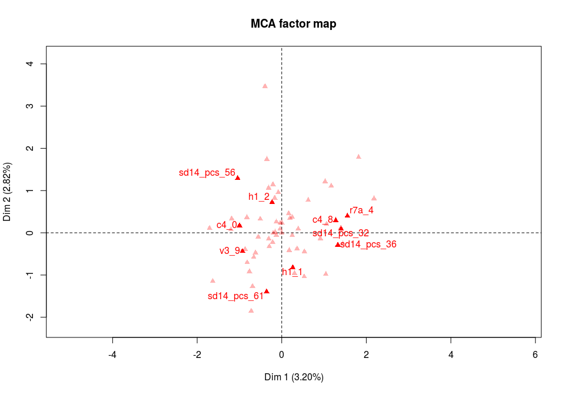

# Bases de données
Joël Gombin  
12 janvier 2016  


# Éléments sur les bases de données 

## Pourquoi utiliser des bases de données ?

R a beaucoup de qualités, mais aussi des défauts. En particulier, il charge en mémoire (vive) l'intégralité des données qu'il utilise. Par conséquent, ses capacités sont limitées par celles de la RAM de la machine qu'on utilise. Dans certains cas, on peut s'en sortir en utilisant une machine plus puissante (serveur distant, par exemple) ; mais parfois même cette solution trouve ses limites, lorsqu'on a de très grosses données. 

La solution consiste alors à utiliser une base de données : les donnée sont stockées sur le disque dur, et le temps d'accès aux données du volume dont on a besoin, pas de la taille totale de la BDD. 

Lorsque les données peuvent être chargées intégralement en mémoire, il n'y a pas vraiment d'intérêt à utiliser une base de données...

## Le SQL

Le SQL (strutured query language) est le langage utilisé pour communiquer avec une base de données (relationnelle, SGBDR). Ce langage est ancien (1974) et est censé être normalisé... sauf qu'il ne l'est pas vraiment. Chaque système de BDD (MySQL, SQLite, PostgreSQL) implémente une partie du langage SQL, et certains implémentent des fonctions qui ne font pas partie du langage. Donc le choix de la BDD utilisée n'estg pas neutre.

De plus, recourir au SQL signifie qu'il faut maîtrise ce langage... qui n'est pas particulièrement simple ni moderne. Et puis, on n'est pas là pour apprendre des langages supplémentaires ! 

## Enters `dplyr`

Le package `dplyr` propose une interface (une API) commune, quelle que soit la source des données (`dataframe` classique, `data.table` ou base de données SQL). Le même code (ou presque) peut donc être utilisé pour traiter des données en mémoire ou dans une BDD. `dplyr` traduit le code R en SQL, l'envoie à la BDD ; la BDD l'exécute et renvoie les résultats à R. Mais comme `dplyr` est intelligent il s'assure de ne récupérer que ce dont il a exactement besoin dans l'immédiat, soit en général un très petit volume de données. 

La syntaxe est simple. Il faut commencer par se connecter à la base de données (par simplicité, on commence ici avec une BDD SQLite, la plus simple à configurer, et on y importe les données - ici l'enquête FES2012 - via R).


```r
library(dplyr)
```

```
## 
## Attaching package: 'dplyr'
## 
## The following objects are masked from 'package:stats':
## 
##     filter, lag
## 
## The following objects are masked from 'package:base':
## 
##     intersect, setdiff, setequal, union
```

```r
library(DBI)
library(RSQLite)
mydb <- src_sqlite("./database/db.sqlite3", create = TRUE)

# on importe un jeu de données (au format stata)

library(haven)
FES2012 <- read_stata("./data/FES2012-v11092012.dta")

# on met ce jeu de données dans notre base de données SQLite
copy_to(mydb, FES2012, temporary = FALSE)
```

```
## Source: sqlite 3.8.6 [./database/db.sqlite3]
## From: FES2012 [2,014 x 305]
## 
##    numquest fxnenq    c2    c3    c4    c7    c8    c9   c10   c11   c12
##       (int)  (chr) (int) (int) (int) (int) (int) (int) (int) (int) (int)
## 1         1 N65769     3     3     5     4     4     2     1     1     1
## 2         2 N65769     5     4     5     4     3     1     1     1     1
## 3         3 N54790     5     3     2     4     4     2     1     2     1
## 4         4 N65491     5     2     7     4     3     1     1     1     1
## 5         5 N65491     5     3     0     4    99     2     2     2     2
## 6         6 N68560     4    88     1     4     4     2     1     1     1
## 7         7 N62089     3     3     7     4     3     1     1     1     1
## 8         8 N71580     3     2     2     4    99     2     1     1     1
## 9         9 N09812     2     2     5     4     4     2     2     2     1
## 10       10 N10991     4     2     5     4    99     1     1     1     1
## ..      ...    ...   ...   ...   ...   ...   ...   ...   ...   ...   ...
## Variables not shown: c13 (int), e1 (int), e2 (int), e5 (int), e6 (int),
##   e7_area (int), e7_area2 (int), e7_code (int), e7_type (int), e9 (int),
##   e10 (int), ef1 (int), ef2 (int), ef3 (int), ef5_1 (int), ef5_2 (int),
##   ef5_3 (int), ef5_4 (int), ef5_5 (int), ef6_1 (int), ef6_2 (int), ef6_3
##   (int), ef6_4 (int), ef6_5 (int), ef7 (int), ef11 (int), g2 (int), g3_1
##   (int), g3_2 (int), g4_1 (int), g4_2 (int), g4_3 (int), h1 (int), i1
##   (int), i2 (int), i3 (int), i4 (int), i5 (int), i6 (int), k1 (int), k2
##   (int), k3 (int), k4 (int), l1_1 (int), l1_2 (int), l1_3 (int), l1_4
##   (int), l1_5 (int), l1_6 (int), l2 (int), l2a (int), l2b (int), l4a1
##   (int), l4a2 (int), l6b1 (int), l6b2 (int), l7 (int), m1 (int), m2 (int),
##   m3 (int), m3a (int), m3b (int), m3c (int), m3d (int), m3e (int), m3f
##   (int), m3g_1 (int), m3g_2 (int), m3g_3 (int), m3g_4 (int), m3g_5 (int),
##   m3g_6 (int), m3g_7 (int), m3g_8 (int), m3g_9 (int), m3g_10 (int), m4
##   (int), m4a (int), m4b (int), m4c (int), m4d (int), m4e (int), m4f (int),
##   m5 (int), m6_1 (int), m6_2 (int), m6_3 (int), m7_1 (int), m7_2 (int),
##   m7_3 (int), m7_4 (int), m7_5 (int), m7_6 (int), m8_1 (int), m8_2 (int),
##   m8_3 (int), m8_4 (int), m8_5 (int), m8_6 (int), m8_7 (int), and 194 more
##   (...).
```

```r
# du coup on peut supprimer la copie locale
rm(FES2012)

tblFES2012 <- tbl(mydb, from = "FES2012")
```

On peut désormais traiter `tblFES2012` exactement comme si c'était un data.frame classique :


```r
glimpse(tblFES2012)
```

```
## Observations: 2,014
## Variables: 305
## $ numquest   (int) 1, 2, 3, 4, 5, 6, 7, 8, 9, 10, 11, 12, 13, 14, 15, ...
## $ fxnenq     (chr) "N65769", "N65769", "N54790", "N65491", "N65491", "...
## $ c2         (int) 3, 5, 5, 5, 5, 4, 3, 3, 2, 4, 5, 4, 3, 3, 1, 4, 4, ...
## $ c3         (int) 3, 4, 3, 2, 3, 88, 3, 2, 2, 2, 3, 2, 2, 2, 2, 4, 2,...
## $ c4         (int) 5, 5, 2, 7, 0, 1, 7, 2, 5, 5, 2, 8, 5, 3, 3, 2, 4, ...
## $ c7         (int) 4, 4, 4, 4, 4, 4, 4, 4, 4, 4, 4, 4, 4, 4, 4, 4, 4, ...
## $ c8         (int) 4, 3, 4, 3, 99, 4, 3, 99, 4, 99, 4, 99, 4, 99, 99, ...
## $ c9         (int) 2, 1, 2, 1, 2, 2, 1, 2, 2, 1, 1, 2, 1, 1, 1, 1, 2, ...
## $ c10        (int) 1, 1, 1, 1, 2, 1, 1, 1, 2, 1, 1, 1, 1, 1, 1, 1, 2, ...
## $ c11        (int) 1, 1, 2, 1, 2, 1, 1, 1, 2, 1, 2, 1, 1, 1, 2, 1, 2, ...
## $ c12        (int) 1, 1, 1, 1, 2, 1, 1, 1, 1, 1, 1, 1, 1, 1, 1, 1, 1, ...
## $ c13        (int) 1, 1, 1, 1, 1, 1, 1, 1, 1, 1, 1, 1, 1, 1, 1, 1, 1, ...
## $ e1         (int) 503, 103, 103, 103, 105, 103, 506, 506, 103, 103, 7...
## $ e2         (int) 103, 100, 101, 101, 100, 101, 100, 1405, 9900, 1910...
## $ e5         (int) 5, 7, 5, 3, 5, 5, 5, 3, 9, 5, 4, 5, 7, 7, 5, 7, 5, ...
## $ e6         (int) 5, 7, 5, 3, 5, 5, 5, 3, 5, 7, 3, 5, 7, 6, 5, 9, 5, ...
## $ e7_area    (int) 999, 999, 999, 999, 999, 999, 999, 999, 999, 999, 9...
## $ e7_area2   (int) 999, 999, 999, 999, 999, 999, 999, 999, 999, 999, 9...
## $ e7_code    (int) 9999, 503, 100, 107, 9999, 9999, 602, 503, 9999, 50...
## $ e7_type    (int) 99, 2, 1, 2, 99, 99, 1, 2, 99, 2, 1, 2, 2, 2, 1, 1,...
## $ e9         (int) 99, 3, 6, 0, 99, 99, 0, 1, 99, 5, 10, 0, 8, 8, 0, 0...
## $ e10        (int) 99, 3, 4, 0, 99, 99, 0, 1, 99, 5, 5, 0, 8, 8, 0, 0,...
## $ ef1        (int) 3, 5, 4, 5, 5, 5, 5, 5, 5, 3, 4, 5, 3, 4, 4, 4, 4, ...
## $ ef2        (int) 2, 3, 3, 4, 4, 3, 3, 4, 2, 1, 4, 3, 2, 2, 2, 2, 3, ...
## $ ef3        (int) 1, 2, 1, 1, 2, 1, 1, 2, 2, 1, 2, 2, 2, 2, 1, 1, 2, ...
## $ ef5_1      (int) 5, 2, 5, 5, 0, 3, 7, 6, 8, 2, 5, 0, 7, 10, 1, 2, 2,...
## $ ef5_2      (int) 3, 2, 8, 3, 0, 88, 1, 3, 4, 5, 5, 3, 5, 10, 0, 5, 7...
## $ ef5_3      (int) 10, 9, 10, 10, 10, 10, 10, 9, 10, 9, 10, 10, 7, 2, ...
## $ ef5_4      (int) 3, 3, 5, 4, 10, 4, 9, 7, 8, 5, 7, 5, 5, 8, 2, 5, 7,...
## $ ef5_5      (int) 3, 1, 3, 4, 6, 88, 0, 0, 8, 3, 2, 5, 4, 3, 2, 0, 2,...
## $ ef6_1      (int) 0, 1, 0, 5, 5, 0, 5, 2, 5, 2, 5, 88, 3, 5, 0, 1, 2,...
## $ ef6_2      (int) 0, 2, 5, 0, 0, 1, 2, 2, 0, 3, 5, 88, 3, 5, 0, 5, 2,...
## $ ef6_3      (int) 10, 10, 10, 7, 10, 8, 10, 5, 10, 9, 10, 10, 7, 8, 1...
## $ ef6_4      (int) 0, 1, 5, 4, 5, 1, 4, 5, 7, 3, 5, 5, 4, 5, 2, 2, 5, ...
## $ ef6_5      (int) 0, 1, 0, 4, 5, 88, 1, 0, 7, 3, 1, 88, 3, 5, 0, 0, 8...
## $ ef7        (int) 2, 2, 1, 2, 2, 1, 1, 1, 1, 2, 1, 1, 1, 2, 1, 2, 2, ...
## $ ef11       (int) 4, 4, 3, 3, 2, 4, 2, 3, 4, 4, 4, 88, 4, 2, 2, 3, 88...
## $ g2         (int) 2, 1, 2, 2, 1, 88, 2, 2, 1, 2, 2, 1, 1, 1, 2, 2, 1,...
## $ g3_1       (int) 1, 1, 1, 2, 1, 1, 1, 1, 1, 1, 1, 1, 2, 2, 2, 1, 1, ...
## $ g3_2       (int) 1, 1, 1, 2, 2, 1, 2, 1, 1, 1, 1, 1, 2, 2, 1, 1, 1, ...
## $ g4_1       (int) 88, 3, 3, 3, 3, 88, 3, 3, 88, 3, 3, 88, 2, 3, 2, 3,...
## $ g4_2       (int) 4, 3, 4, 4, 3, 3, 3, 3, 4, 4, 4, 3, 88, 4, 3, 4, 3,...
## $ g4_3       (int) 3, 4, 3, 4, 3, 3, 3, 3, 1, 4, 4, 88, 3, 2, 4, 2, 3,...
## $ h1         (int) 2, 2, 2, 2, 1, 2, 2, 1, 2, 1, 2, 1, 2, 1, 1, 2, 1, ...
## $ i1         (int) 1, 3, 2, 3, 4, 3, 3, 5, 2, 2, 3, 5, 5, 3, 3, 3, 4, ...
## $ i2         (int) 1, 5, 2, 5, 5, 3, 4, 5, 3, 3, 4, 5, 5, 4, 3, 4, 4, ...
## $ i3         (int) 2, 2, 3, 3, 1, 2, 2, 2, 2, 2, 2, 1, 2, 2, 3, 3, 3, ...
## $ i4         (int) 4, 3, 4, 2, 3, 5, 2, 2, 3, 3, 4, 2, 3, 4, 5, 3, 2, ...
## $ i5         (int) 7, 7, 7, 7, 8, 10, 6, 7, 8, 5, 6, 6, 5, 0, 4, 7, 8,...
## $ i6         (int) 5, 3, 1, 6, 5, 5, 4, 6, 3, 5, 2, 5, 5, 5, 5, 2, 6, ...
## $ k1         (int) 2, 1, 88, 88, 1, 88, 1, 1, 88, 88, 1, 1, 2, 2, 88, ...
## $ k2         (int) 2, 2, 2, 88, 2, 2, 2, 1, 1, 1, 2, 2, 2, 1, 1, 1, 1,...
## $ k3         (int) 88, 88, 88, 88, 1, 88, 1, 1, 88, 1, 1, 1, 88, 2, 2,...
## $ k4         (int) 88, 2, 88, 88, 2, 88, 2, 2, 88, 2, 2, 2, 2, 88, 88,...
## $ l1_1       (int) 5, 3, 3, 0, 3, 2, 1, 2, 2, 4, 1, 0, 5, 7, 4, 4, 4, ...
## $ l1_2       (int) 6, 6, 2, 2, 0, 3, 4, 2, 2, 7, 1, 3, 5, 7, 2, 2, 4, ...
## $ l1_3       (int) 5, 5, 2, 0, 0, 2, 4, 1, 5, 7, 1, 0, 4, 5, 2, 3, 2, ...
## $ l1_4       (int) 5, 2, 3, 5, 0, 88, 0, 2, 2, 6, 1, 4, 5, 5, 2, 6, 6,...
## $ l1_5       (int) 4, 4, 1, 4, 88, 2, 1, 1, 2, 6, 1, 3, 5, 8, 2, 4, 4,...
## $ l1_6       (int) 7, 4, 5, 2, 0, 88, 3, 2, 4, 7, 4, 5, 6, 9, 4, 7, 6,...
## $ l2         (int) 0, 0, 2, 4, 6, 0, 2, 0, 0, 5, 0, 0, 7, 10, 0, 6, 2,...
## $ l2a        (int) 99, 99, 3, 99, 99, 1, 99, 0, 6, 99, 99, 0, 99, 99, ...
## $ l2b        (int) 2, 0, 99, 0, 6, 99, 0, 99, 99, 7, 0, 99, 7, 5, 99, ...
## $ l4a1       (int) 99, 99, 5, 99, 99, 88, 99, 2, 10, 99, 99, 8, 99, 99...
## $ l4a2       (int) 99, 99, 5, 99, 99, 6, 99, 2, 5, 99, 99, 4, 99, 99, ...
## $ l6b1       (int) 5, 2, 99, 0, 0, 99, 2, 99, 99, 7, 0, 99, 5, 7, 99, ...
## $ l6b2       (int) 4, 2, 99, 0, 0, 99, 3, 99, 99, 7, 0, 99, 5, 6, 99, ...
## $ l7         (int) 3, 2, 3, 3, 4, 2, 3, 2, 2, 4, 1, 4, 4, 3, 3, 3, 3, ...
## $ m1         (int) 2, 1, 2, 1, 1, 2, 1, 1, 1, 1, 1, 1, 1, 2, 1, 1, 2, ...
## $ m2         (int) 6, 1, 6, 1, 3, 5, 2, 3, 2, 1, 2, 1, 1, 6, 6, 1, 6, ...
## $ m3         (int) 2, 2, 2, 1, 2, 2, 1, 2, 2, 2, 2, 1, 2, 2, 2, 2, 2, ...
## $ m3a        (int) 99, 99, 99, 2, 99, 99, 2, 99, 99, 99, 99, 2, 99, 99...
## $ m3b        (int) 99, 99, 99, 2, 99, 99, 1, 99, 99, 99, 99, 1, 99, 99...
## $ m3c        (int) 99, 99, 99, 2, 99, 99, 2, 99, 99, 99, 99, 2, 99, 99...
## $ m3d        (int) 99, 99, 99, 2, 99, 99, 2, 99, 99, 99, 99, 2, 99, 99...
## $ m3e        (int) 99, 99, 99, 2, 99, 99, 1, 99, 99, 99, 99, 2, 99, 99...
## $ m3f        (int) 99, 99, 99, 1, 99, 99, 1, 99, 99, 99, 99, 2, 99, 99...
## $ m3g_1      (int) 99, 99, 99, 0, 99, 99, 0, 99, 99, 99, 99, 0, 99, 99...
## $ m3g_2      (int) 99, 99, 99, 0, 99, 99, 0, 99, 99, 99, 99, 0, 99, 99...
## $ m3g_3      (int) 99, 99, 99, 1, 99, 99, 0, 99, 99, 99, 99, 0, 99, 99...
## $ m3g_4      (int) 99, 99, 99, 0, 99, 99, 0, 99, 99, 99, 99, 0, 99, 99...
## $ m3g_5      (int) 99, 99, 99, 0, 99, 99, 1, 99, 99, 99, 99, 1, 99, 99...
## $ m3g_6      (int) 99, 99, 99, 0, 99, 99, 0, 99, 99, 99, 99, 0, 99, 99...
## $ m3g_7      (int) 99, 99, 99, 0, 99, 99, 0, 99, 99, 99, 99, 1, 99, 99...
## $ m3g_8      (int) 99, 99, 99, 0, 99, 99, 0, 99, 99, 99, 99, 0, 99, 99...
## $ m3g_9      (int) 99, 99, 99, 0, 99, 99, 0, 99, 99, 99, 99, 1, 99, 99...
## $ m3g_10     (int) 99, 99, 99, 0, 99, 99, 0, 99, 99, 99, 99, 0, 99, 99...
## $ m4         (int) 2, 2, 2, 2, 2, 2, 2, 2, 2, 2, 2, 2, 2, 2, 2, 2, 2, ...
## $ m4a        (int) 99, 99, 99, 99, 99, 99, 99, 99, 99, 99, 99, 99, 99,...
## $ m4b        (int) 99, 99, 99, 99, 99, 99, 99, 99, 99, 99, 99, 99, 99,...
## $ m4c        (int) 99, 99, 99, 99, 99, 99, 99, 99, 99, 99, 99, 99, 99,...
## $ m4d        (int) 99, 99, 99, 99, 99, 99, 99, 99, 99, 99, 99, 99, 99,...
## $ m4e        (int) 99, 99, 99, 99, 99, 99, 99, 99, 99, 99, 99, 99, 99,...
## $ m4f        (int) 99, 99, 99, 99, 99, 99, 99, 99, 99, 99, 99, 99, 99,...
## $ m5         (int) 99, 2, 99, 1, 2, 99, 2, 2, 2, 2, 2, 2, 2, 99, 99, 2...
## $ m6_1       (int) 99, 2, 99, 1, 2, 99, 1, 2, 2, 2, 2, 2, 2, 99, 99, 2...
## $ m6_2       (int) 99, 2, 99, 1, 2, 99, 1, 2, 2, 2, 2, 2, 2, 99, 99, 2...
## $ m6_3       (int) 99, 2, 99, 2, 2, 99, 2, 2, 2, 2, 2, 2, 2, 99, 99, 2...
## $ m7_1       (int) 99, 2, 99, 2, 2, 99, 1, 2, 1, 1, 2, 2, 1, 99, 99, 1...
## $ m7_2       (int) 99, 1, 99, 2, 2, 99, 2, 2, 2, 2, 2, 2, 2, 99, 99, 2...
## $ m7_3       (int) 99, 2, 99, 1, 2, 99, 1, 2, 2, 2, 2, 2, 2, 99, 99, 2...
## $ m7_4       (int) 99, 1, 99, 1, 2, 99, 2, 2, 2, 2, 2, 2, 2, 99, 99, 2...
## $ m7_5       (int) 99, 2, 99, 1, 2, 99, 2, 2, 2, 2, 2, 2, 2, 99, 99, 2...
## $ m7_6       (int) 99, 2, 99, 1, 2, 99, 2, 2, 2, 2, 2, 2, 2, 99, 99, 2...
## $ m8_1       (int) 99, 2, 99, 2, 2, 99, 2, 2, 2, 2, 2, 2, 2, 99, 2, 2,...
## $ m8_2       (int) 2, 1, 2, 2, 2, 2, 2, 2, 2, 2, 2, 1, 2, 2, 2, 2, 2, ...
## $ m8_3       (int) 99, 1, 99, 1, 2, 99, 2, 2, 2, 2, 2, 2, 2, 99, 2, 2,...
## $ m8_4       (int) 1, 1, 1, 1, 2, 1, 1, 1, 1, 1, 1, 1, 1, 1, 1, 1, 1, ...
## $ m8_5       (int) 99, 1, 99, 2, 2, 99, 2, 2, 2, 2, 2, 2, 2, 99, 99, 2...
## $ m8_6       (int) 2, 1, 2, 2, 2, 2, 1, 1, 2, 2, 1, 2, 2, 2, 2, 2, 2, ...
## $ m8_7       (int) 99, 2, 99, 2, 2, 99, 2, 2, 2, 2, 2, 2, 2, 99, 99, 2...
## $ m8_8       (int) 2, 2, 2, 2, 2, 2, 2, 2, 2, 2, 2, 2, 2, 2, 2, 2, 2, ...
## $ m9_1       (int) 99, 1, 99, 1, 2, 99, 1, 1, 1, 1, 1, 1, 1, 99, 99, 1...
## $ m9_2       (int) 99, 1, 99, 1, 2, 99, 1, 2, 2, 2, 1, 1, 1, 99, 99, 2...
## $ m9_3       (int) 99, 2, 99, 2, 2, 99, 2, 2, 2, 2, 2, 2, 2, 99, 99, 2...
## $ m9_4       (int) 99, 2, 99, 2, 2, 99, 2, 2, 1, 2, 2, 2, 2, 99, 99, 2...
## $ m10_1      (int) 2, 1, 2, 1, 2, 2, 1, 1, 1, 2, 1, 1, 1, 1, 2, 1, 1, ...
## $ m10_2      (int) 2, 1, 1, 1, 2, 2, 1, 1, 2, 1, 1, 1, 2, 1, 1, 2, 2, ...
## $ m10_3      (int) 2, 2, 2, 2, 2, 2, 2, 2, 2, 1, 1, 1, 2, 2, 1, 2, 2, ...
## $ m10_4      (int) 2, 1, 2, 2, 2, 2, 2, 2, 2, 1, 2, 1, 2, 2, 1, 2, 2, ...
## $ m11        (int) 12, 12, 12, 99, 99, 99, 12, 12, 12, 12, 99, 99, 12,...
## $ p1         (int) 3, 2, 3, 4, 4, 88, 2, 2, 2, 3, 3, 3, 4, 3, 3, 2, 3,...
## $ p1b        (int) 5, 2, 3, 5, 5, 3, 3, 5, 3, 5, 5, 2, 5, 5, 2, 5, 2, ...
## $ p2         (int) 4, 5, 1, 1, 6, 1, 4, 1, 1, 1, 1, 4, 4, 4, 1, 1, 4, ...
## $ p3         (int) 3, 2, 3, 4, 1, 2, 4, 8, 5, 4, 3, 8, 8, 5, 8, 2, 4, ...
## $ p7         (int) 2, 2, 1, 2, 2, 1, 1, 1, 1, 2, 2, 1, 1, 1, 1, 1, 1, ...
## $ p8         (int) 2, 2, 99, 2, 2, 99, 99, 99, 99, 2, 2, 99, 99, 99, 9...
## $ p9         (int) 99, 99, 2, 99, 99, 2, 2, 2, 2, 99, 99, 2, 1, 2, 2, ...
## $ p10        (int) 2, 2, 2, 2, 2, 2, 2, 2, 2, 2, 2, 2, 2, 2, 2, 2, 2, ...
## $ p11        (int) 2, 2, 2, 2, 2, 2, 1, 2, 2, 2, 2, 1, 1, 1, 2, 2, 2, ...
## $ p12        (int) 1, 1, 2, 1, 2, 2, 1, 1, 1, 1, 1, 1, 1, 1, 1, 1, 1, ...
## $ p13_1      (int) 1, 1, 2, 1, 1, 1, 1, 1, 2, 1, 1, 1, 1, 1, 1, 1, 1, ...
## $ p13_2      (int) 2, 1, 2, 1, 2, 1, 1, 2, 1, 1, 1, 2, 1, 2, 2, 2, 2, ...
## $ p13_3      (int) 1, 2, 1, 1, 1, 1, 1, 1, 1, 1, 1, 1, 1, 1, 1, 1, 1, ...
## $ p13_4      (int) 2, 1, 2, 1, 2, 1, 1, 1, 1, 2, 1, 1, 1, 1, 2, 1, 1, ...
## $ p13_5      (int) 2, 1, 2, 1, 1, 1, 1, 1, 1, 1, 1, 1, 1, 2, 1, 1, 2, ...
## $ p14        (int) 2, 1, 1, 1, 1, 2, 2, 2, 2, 2, 1, 2, 2, 2, 2, 2, 2, ...
## $ p15        (int) 1, 1, 1, 1, 1, 1, 1, 1, 1, 1, 1, 1, 1, 1, 1, 1, 1, ...
## $ p16        (int) 2, 1, 1, 1, 1, 1, 2, 2, 2, 1, 1, 2, 2, 2, 2, 2, 2, ...
## $ p17        (int) 77, 2, 5, 1, 1, 7, 7, 6, 6, 3, 1, 6, 8, 3, 7, 7, 7,...
## $ p19        (int) 1, 1, 5, 3, 1, 2, 2, 3, 6, 99, 99, 3, 6, 99, 7, 6, ...
## $ r1         (int) 2, 2, 2, 2, 2, 1, 2, 2, 2, 3, 1, 1, 2, 2, 2, 4, 1, ...
## $ r2         (int) 2500, 3000, 3000, 1500, 2000, 2000, 2500, 2000, 300...
## $ r3         (int) 6000, 5500, 5000, 5000, 5000, 4000, 5000, 6000, 600...
## $ r7a        (int) 8, 7, 7, 5, 10, 9, 6, 7, 6, 6, 9, 6, 6, 6, 6, 6, 6,...
## $ r7b        (int) 10, 5, 7, 10, 6, 10, 4, 7, 6, 6, 8, 7, 7, 6, 7, 9, ...
## $ s1_1       (int) 4, 2, 2, 2, 2, 1, 2, 1, 1, 4, 1, 1, 2, 4, 1, 2, 2, ...
## $ s1_2       (int) 2, 1, 1, 2, 2, 2, 1, 1, 3, 3, 1, 1, 3, 3, 1, 3, 2, ...
## $ s1_3       (int) 2, 3, 1, 3, 3, 1, 2, 2, 2, 1, 3, 1, 3, 2, 1, 4, 2, ...
## $ s1_4       (int) 3, 3, 4, 88, 5, 3, 3, 4, 3, 3, 5, 3, 4, 4, 2, 3, 4,...
## $ s1_5       (int) 2, 2, 1, 2, 2, 2, 2, 2, 1, 2, 2, 2, 3, 3, 2, 2, 2, ...
## $ s1_6       (int) 3, 3, 2, 88, 88, 2, 5, 2, 2, 1, 3, 1, 2, 2, 2, 2, 2...
## $ s1_7       (int) 3, 1, 5, 3, 4, 1, 2, 2, 1, 2, 3, 2, 3, 3, 1, 1, 2, ...
## $ s1_8       (int) 2, 3, 1, 2, 2, 2, 3, 3, 3, 3, 2, 2, 3, 2, 2, 5, 2, ...
## $ sd1        (int) 4, 4, 3, 3, 3, 4, 3, 4, 5, 4, 4, 1, 1, 4, 4, 3, 3, ...
## $ sd2        (int) 2003, 2004, 1984, 2008, 2007, 1978, 1979, 1998, 200...
## $ sd3a       (int) 1941, 1974, 1964, 1987, 1954, 1956, 1946, 1967, 197...
## $ sd3m       (int) 7, 10, 5, 11, 4, 7, 6, 3, 8, 9, 3, 2, 6, 5, 12, 5, ...
## $ sd4        (int) 4, 2, 1, 1, 1, 3, 0, 2, 0, 0, 2, 1, 1, 2, 3, 2, 2, ...
## $ sd4b       (int) 0, 2, 1, 1, 0, 0, 99, 2, 99, 99, 2, 0, 0, 0, 3, 2, ...
## $ sd4c       (int) 0, 0, 0, 1, 0, 0, 99, 0, 99, 99, 0, 0, 0, 0, 0, 0, ...
## $ sd4d       (int) 0, 2, 0, 0, 0, 0, 99, 2, 99, 99, 1, 0, 0, 0, 3, 2, ...
## $ sd4e       (int) 0, 0, 1, 0, 0, 0, 99, 0, 99, 99, 1, 0, 0, 0, 0, 0, ...
## $ sd5        (int) 2, 3, 3, 3, 1, 2, 1, 4, 2, 1, 3, 2, 2, 2, 5, 4, 2, ...
## $ sd5b       (int) 1, 2, 1, 2, 99, 1, 99, 1, 1, 99, 2, 1, 1, 1, 1, 1, ...
## $ sd8        (int) 1, 99, 3, 99, 99, 3, 99, 1, 1, 99, 99, 1, 1, 1, 3, ...
## $ sd9        (int) 99, 99, 5, 99, 99, 88, 99, 99, 99, 99, 99, 99, 99, ...
## $ sd10       (int) 2, 9, 2, 7, 11, 5, 14, 7, 15, 10, 7, 18, 10, 3, 4, ...
## $ sd11       (int) 7, 6, 2, 1, 9, 2, 7, 1, 9, 1, 1, 10, 7, 7, 1, 1, 7,...
## $ sd12       (int) 99, 99, 1, 99, 99, 2, 99, 99, 99, 99, 99, 99, 99, 9...
## $ sd13       (int) 6, 6, 6, 6, 99, 6, 4, 5, 99, 6, 4, 99, 6, 6, 6, 6, ...
## $ sd14_isco4 (int) 9333, 5141, 9112, 5120, 999, 9112, 2341, 8311, 999,...
## $ sd14_pcs   (int) 66, 56, 66, 61, 999, 66, 41, 61, 999, 47, 61, 999, ...
## $ sd17_nace  (int) 3, 19, 19, 9, 99, 19, 16, 8, 99, 13, 16, 99, 11, 7,...
## $ sd18       (int) 0, 0, 0, 0, 999999, 888888, 0, 0, 999999, 0, 4, 999...
## $ sd19       (int) 4, 1, 4, 1, 99, 4, 2, 4, 99, 4, 2, 99, 2, 4, 3, 3, ...
## $ sd20       (int) 39, 37, 12, 35, 999, 32, 36, 35, 999, 35, 35, 999, ...
## $ sd21       (int) 1, 1, 2, 1, 99, 1, 99, 1, 99, 3, 99, 99, 1, 3, 1, 1...
## $ sd22       (int) 2, 1, 2, 1, 1, 2, 2, 2, 1, 1, 1, 2, 2, 2, 2, 2, 1, ...
## $ sd23       (int) 99, 2, 99, 2, 1, 99, 99, 99, 2, 2, 2, 99, 99, 99, 9...
## $ sd24       (int) 99, 99, 4, 3, 99, 3, 99, 2, 99, 3, 2, 99, 99, 99, 3...
## $ sd25       (int) 7, 99, 1, 99, 99, 9, 99, 1, 1, 99, 99, 10, 7, 7, 1,...
## $ sd26       (int) 6, 99, 6, 99, 99, 99, 99, 4, 6, 99, 99, 99, 4, 5, 7...
## $ sd27_isco3 (int) 722, 9999, 432, 9999, 9999, 9999, 9999, 334, 522, 9...
## $ sd30_nace  (int) 3, 99, 3, 99, 99, 99, 99, 17, 7, 99, 99, 99, 10, 3,...
## $ sd31       (int) 99, 99, 3, 99, 99, 99, 99, 3, 3, 99, 99, 99, 99, 99...
## $ sd32       (int) 2, 1, 2, 1, 1, 2, 1, 1, 2, 1, 1, 1, 2, 1, 1, 2, 1, ...
## $ sd33       (int) 99, 99, 99, 99, 99, 99, 99, 99, 99, 99, 99, 99, 99,...
## $ sd34_isco2 (int) 52, 71, 61, 71, 43, 71, 23, 31, 73, 75, 91, 23, 51,...
## $ sd35       (int) 3, 4, 4, 4, 2, 3, 1, 1, 4, 4, 2, 1, 4, 4, 1, 3, 3, ...
## $ sd36       (int) 2, 3, 2, 88, 2, 2, 6, 3, 3, 2, 1, 2, 3, 2, 2, 3, 2,...
## $ sd37       (int) 1, 1, 1, 1, 1, 1, 1, 1, 1, 1, 1, 1, 1, 1, 1, 1, 1, ...
## $ sd44       (int) 5, 4, 5, 6, 6, 5, 6, 5, 5, 5, 5, 5, 5, 5, 5, 5, 5, ...
## $ sd45       (int) 4, 2, 3, 4, 4, 4, 4, 4, 4, 3, 4, 2, 2, 3, 4, 4, 2, ...
## $ sd46       (int) 1, 1, 1, 6, 6, 1, 6, 6, 1, 1, 1, 1, 1, 1, 1, 1, 1, ...
## $ sd47       (int) 2, 2, 2, 2, 2, 2, 1, 1, 2, 2, 2, 2, 2, 2, 1, 2, 2, ...
## $ sd48       (int) 2, 2, 2, 2, 2, 2, 2, 2, 2, 2, 2, 2, 2, 2, 2, 1, 2, ...
## $ sp1        (int) 6, 3, 6, 5, 5, 5, 4, 2, 5, 5, 0, 0, 5, 7, 5, 0, 6, ...
## $ sp2_1      (int) 6, 1, 7, 10, 0, 88, 2, 4, 4, 88, 4, 5, 3, 0, 4, 1, ...
## $ sp2_2      (int) 5, 1, 6, 8, 5, 88, 4, 4, 6, 4, 5, 8, 4, 4, 5, 5, 6,...
## $ sp2_3      (int) 6, 5, 5, 5, 88, 88, 88, 4, 4, 88, 7, 8, 4, 5, 10, 5...
## $ sp2_4      (int) 6, 7, 2, 0, 10, 10, 8, 8, 7, 10, 7, 10, 5, 8, 10, 8...
## $ sp2_5      (int) 6, 6, 5, 0, 88, 5, 88, 8, 7, 88, 10, 10, 2, 2, 5, 5...
## $ sp3        (int) 0, 1, 0, 7, 10, 3, 5, 5, 6, 5, 5, 4, 2, 0, 0, 0, 5,...
## $ sp4_1      (int) 6, 88, 8, 10, 8, 88, 4, 3, 3, 10, 5, 4, 6, 2, 6, 7,...
## $ sp4_2      (int) 6, 10, 6, 8, 8, 5, 4, 7, 6, 7, 6, 4, 6, 8, 7, 8, 5,...
## $ sp4_3      (int) 5, 5, 4, 5, 0, 88, 4, 7, 5, 7, 3, 4, 4, 6, 3, 5, 4,...
## $ sp4_4      (int) 2, 3, 2, 0, 0, 1, 2, 1, 3, 3, 3, 0, 5, 8, 0, 3, 2, ...
## $ sp4_5      (int) 1, 1, 0, 0, 0, 0, 0, 0, 1, 0, 1, 0, 2, 0, 0, 0, 0, ...
## $ sp5        (int) 2, 7, 4, 8, 8, 88, 8, 8, 5, 5, 7, 7, 5, 2, 5, 4, 5,...
## $ sp6_1      (int) 10, 5, 5, 10, 8, 88, 9, 6, 7, 88, 7, 5, 7, 2, 3, 5,...
## $ sp6_2      (int) 10, 9, 4, 8, 10, 5, 10, 8, 8, 7, 7, 5, 7, 8, 7, 9, ...
## $ sp6_3      (int) 4, 5, 4, 5, 88, 88, 7, 5, 5, 88, 4, 5, 7, 4, 2, 5, ...
## $ sp6_4      (int) 2, 2, 1, 0, 0, 0, 2, 1, 4, 2, 2, 0, 5, 5, 2, 3, 3, ...
## $ sp6_5      (int) 2, 2, 5, 0, 0, 88, 88, 4, 4, 88, 8, 0, 88, 3, 5, 5,...
## $ sp9        (int) 0, 1, 5, 5, 9, 4, 3, 3, 4, 7, 5, 5, 5, 7, 0, 0, 2, ...
## $ sp10_1     (int) 5, 5, 5, 6, 0, 88, 88, 2, 4, 88, 5, 5, 7, 2, 3, 5, ...
## $ sp10_2     (int) 5, 5, 6, 7, 0, 88, 4, 5, 4, 5, 5, 5, 7, 7, 4, 6, 5,...
## $ sp10_3     (int) 4, 88, 5, 6, 88, 88, 88, 5, 4, 88, 6, 5, 7, 4, 2, 5...
## $ sp10_4     (int) 0, 6, 5, 0, 0, 88, 2, 5, 6, 8, 6, 5, 5, 8, 1, 8, 5,...
## $ sp10_5     (int) 0, 1, 5, 0, 0, 88, 0, 0, 1, 0, 0, 0, 3, 0, 3, 0, 2,...
## $ sp11       (int) 2, 2, 2, 2, 3, 4, 3, 3, 4, 4, 1, 2, 4, 1, 4, 2, 4, ...
## $ sp12       (int) 5, 3, 6, 8, 10, 5, 10, 10, 6, 6, 8, 8, 5, 7, 7, 2, ...
## $ sp12_1     (int) 0, 1, 0, 10, 5, 88, 3, 10, 2, 0, 7, 4, 4, 0, 4, 0, ...
## $ sp12_2     (int) 0, 0, 0, 2, 5, 0, 5, 5, 2, 0, 9, 3, 2, 0, 0, 0, 2, ...
## $ sp12_3     (int) 0, 4, 0, 3, 0, 88, 5, 5, 2, 2, 3, 6, 6, 5, 2, 2, 2,...
## $ sp12_4     (int) 5, 5, 0, 0, 0, 1, 1, 0, 2, 7, 2, 3, 8, 9, 1, 8, 1, ...
## $ sp12_5     (int) 5, 3, 10, 0, 0, 5, 0, 0, 5, 1, 0, 0, 2, 3, 8, 9, 0,...
## $ v1         (int) 1, 1, 1, 1, 1, 1, 1, 1, 1, 2, 1, 1, 1, 1, 1, 1, 1, ...
## $ v3         (int) 9, 9, 9, 3, 5, 5, 5, 3, 9, 99, 5, 5, 7, 7, 8, 9, 5,...
## $ v4         (int) 2, 1, 2, 2, 2, 1, 1, 2, 1, 99, 1, 2, 2, 2, 1, 2, 2,...
## $ v5_1       (int) 99, 0, 99, 99, 99, 0, 0, 99, 0, 99, 0, 99, 99, 99, ...
## $ v5_2       (int) 99, 0, 99, 99, 99, 0, 0, 99, 0, 99, 0, 99, 99, 99, ...
## $ v5_3       (int) 99, 0, 99, 99, 99, 0, 1, 99, 0, 99, 1, 99, 99, 99, ...
## $ v5_4       (int) 99, 0, 99, 99, 99, 0, 0, 99, 0, 99, 0, 99, 99, 99, ...
## $ v5_5       (int) 99, 0, 99, 99, 99, 0, 0, 99, 1, 99, 0, 99, 99, 99, ...
## $ v5_6       (int) 99, 0, 99, 99, 99, 0, 0, 99, 0, 99, 0, 99, 99, 99, ...
## $ v5_7       (int) 99, 1, 99, 99, 99, 0, 0, 99, 0, 99, 0, 99, 99, 99, ...
## $ v5_8       (int) 99, 0, 99, 99, 99, 0, 0, 99, 0, 99, 0, 99, 99, 99, ...
## $ v5_9       (int) 99, 0, 99, 99, 99, 1, 0, 99, 0, 99, 0, 99, 99, 99, ...
## $ v5_10      (int) 99, 0, 99, 99, 99, 0, 0, 99, 0, 99, 0, 99, 99, 99, ...
## $ v6         (int) 1, 1, 1, 1, 1, 1, 1, 1, 1, 1, 1, 1, 1, 1, 1, 2, 1, ...
## $ v8         (int) 1, 2, 1, 1, 1, 1, 1, 1, 1, 2, 1, 1, 2, 2, 1, 99, 1,...
## $ v9         (int) 1, 1, 1, 1, 1, 1, 1, 1, 1, 1, 1, 1, 1, 1, 1, 1, 1, ...
## $ v10        (int) 5, 9, 9, 2, 5, 5, 5, 2, 5, 5, 4, 5, 8, 8, 5, 9, 5, ...
## $ v13        (int) 1, 1, 1, 1, 1, 1, 1, 1, 1, 1, 1, 1, 1, 1, 1, 1, 1, ...
## $ v14        (int) 9, 7, 11, 7, 7, 7, 7, 4, 11, 9, 6, 88, 8, 9, 11, 9,...
## $ v15        (int) 1, 1, 1, 1, 1, 1, 1, 1, 1, 1, 1, 1, 1, 1, 1, 1, 1, ...
## $ v16        (int) 2, 2, 3, 1, 2, 1, 1, 1, 1, 2, 1, 88, 1, 2, 1, 2, 2,...
## $ v17_1      (int) 4, 4, 0, 9, 7, 88, 8, 10, 5, 0, 6, 5, 2, 0, 10, 0, ...
## $ v17_2      (int) 0, 6, 0, 7, 7, 88, 8, 5, 5, 2, 8, 7, 2, 2, 0, 6, 5,...
## $ v17_3      (int) 6, 4, 8, 6, 10, 9, 10, 10, 8, 5, 6, 8, 5, 6, 10, 1,...
## $ v17_4      (int) 0, 5, 0, 6, 0, 88, 2, 2, 3, 2, 0, 7, 5, 5, 0, 2, 2,...
## $ v17_5      (int) 6, 5, 4, 3, 3, 1, 0, 0, 0, 7, 0, 4, 8, 8, 0, 7, 1, ...
## $ v17_6      (int) 5, 5, 9, 0, 0, 4, 0, 0, 8, 3, 0, 0, 2, 3, 8, 8, 0, ...
## $ v18_1      (int) 3, 3, 2, 8, 7, 4, 8, 10, 3, 1, 6, 7, 3, 0, 7, 0, 4,...
## $ v18_2      (int) 0, 3, 0, 2, 7, 0, 10, 4, 3, 1, 5, 7, 2, 2, 1, 0, 2,...
## $ v18_3      (int) 7, 4, 5, 7, 10, 9, 10, 10, 6, 5, 6, 8, 7, 6, 9, 1, ...
## $ v18_4      (int) 0, 5, 0, 3, 0, 88, 4, 3, 3, 1, 0, 8, 6, 5, 2, 0, 3,...
## $ v18_5      (int) 5, 6, 2, 0, 4, 2, 0, 0, 0, 7, 0, 5, 8, 8, 2, 6, 3, ...
## $ v18_6      (int) 7, 5, 7, 0, 0, 5, 0, 0, 6, 3, 0, 0, 2, 5, 9, 8, 0, ...
## $ v19_1      (int) 1, 3, 0, 0, 0, 1, 1, 0, 2, 0, 0, 0, 2, 0, 0, 1, 2, ...
## $ v19_2      (int) 3, 4, 3, 3, 3, 5, 4, 5, 2, 5, 4, 5, 2, 2, 0, 2, 4, ...
## $ v19_3      (int) 2, 4, 3, 2, 3, 1, 4, 2, 4, 3, 2, 5, 4, 0, 0, 2, 3, ...
## $ v19_4      (int) 5, 5, 6, 8, 6, 88, 7, 6, 6, 4, 5, 5, 5, 5, 96, 5, 6...
## $ v19_5      (int) 7, 7, 8, 10, 10, 8, 10, 10, 7, 7, 8, 8, 7, 8, 10, 7...
## $ v19_6      (int) 5, 7, 10, 10, 10, 5, 10, 10, 5, 5, 10, 10, 8, 4, 5,...
## $ v20_1      (int) 1, 0, 0, 0, 0, 88, 0, 0, 2, 0, 1, 3, 4, 0, 4, 1, 2,...
## $ v20_2      (int) 3, 2, 3, 88, 3, 5, 3, 5, 2, 2, 4, 5, 3, 2, 2, 2, 4,...
## $ v20_3      (int) 2, 2, 4, 2, 3, 1, 3, 3, 1, 3, 2, 5, 5, 0, 0, 2, 3, ...
## $ v20_4      (int) 5, 5, 7, 8, 5, 88, 7, 6, 8, 5, 5, 5, 6, 5, 10, 5, 6...
## $ v20_5      (int) 7, 8, 8, 10, 10, 8, 10, 10, 8, 7, 9, 8, 7, 10, 10, ...
## $ v20_6      (int) 5, 7, 10, 10, 10, 6, 10, 10, 7, 5, 10, 10, 8, 5, 5,...
## $ v21        (int) 4, 7, 9, 1, 3, 1, 1, 1, 5, 5, 2, 5, 6, 7, 4, 7, 3, ...
## $ v22        (int) 2, 3, 4, 4, 4, 3, 4, 4, 4, 2, 4, 3, 2, 2, 3, 2, 3, ...
## $ v24        (int) 2, 2, 1, 1, 1, 2, 1, 1, 2, 2, 2, 88, 1, 2, 2, 1, 1,...
## $ v25        (int) 2, 2, 99, 99, 99, 1, 99, 99, 1, 2, 2, 1, 99, 1, 1, ...
## $ v26        (int) 99, 99, 10, 4, 6, 6, 6, 2, 6, 99, 99, 6, 9, 9, 6, 1...
## $ v27        (int) 99, 99, 2, 2, 2, 2, 2, 1, 3, 99, 99, 3, 2, 2, 3, 2,...
## $ w1_1       (int) 1, 1, 1, 3, 3, 2, 3, 3, 2, 3, 2, 3, 2, 1, 1, 1, 2, ...
## $ w1_2       (int) 2, 2, 2, 2, 2, 1, 2, 2, 1, 1, 2, 1, 2, 2, 2, 2, 2, ...
## $ w1_3       (int) 1, 2, 1, 3, 4, 1, 4, 3, 3, 3, 3, 4, 2, 2, 2, 1, 2, ...
## $ w1_4       (int) 2, 4, 2, 4, 4, 2, 4, 2, 3, 3, 4, 3, 2, 3, 2, 2, 3, ...
## $ w1_5       (int) 4, 4, 3, 4, 4, 1, 4, 3, 4, 4, 4, 4, 2, 1, 2, 4, 4, ...
## $ w1_6       (int) 2, 2, 4, 1, 2, 88, 2, 3, 3, 3, 1, 3, 3, 3, 2, 3, 4,...
## $ w1_7       (int) 4, 4, 2, 2, 1, 3, 2, 3, 2, 3, 1, 4, 4, 2, 2, 4, 4, ...
## $ w1_8       (int) 2, 3, 2, 2, 1, 1, 2, 2, 1, 2, 1, 1, 2, 1, 1, 2, 88,...
## $ w2_1       (int) 2, 3, 3, 3, 4, 88, 4, 4, 3, 2, 4, 4, 2, 2, 2, 3, 3,...
## $ w2_2       (int) 4, 4, 4, 88, 2, 4, 2, 3, 3, 4, 3, 2, 88, 4, 4, 3, 4...
## $ w2_3       (int) 2, 3, 2, 2, 3, 88, 88, 2, 2, 3, 1, 2, 2, 2, 2, 3, 3...
## $ w2_4       (int) 2, 2, 2, 3, 3, 3, 4, 2, 3, 2, 2, 3, 2, 3, 2, 2, 2, ...
## $ w3         (int) 2, 2, 2, 2, 2, 2, 88, 2, 2, 2, 1, 1, 88, 1, 2, 1, 2...
## $ w5_1       (int) 1, 1, 1, 4, 4, 1, 1, 3, 3, 3, 4, 3, 1, 1, 1, 1, 1, ...
## $ w5_2       (int) 3, 4, 3, 1, 1, 2, 2, 2, 2, 3, 2, 2, 3, 3, 3, 4, 2, ...
## $ w5_3       (int) 1, 3, 2, 4, 4, 2, 4, 4, 2, 3, 3, 4, 2, 1, 3, 2, 3, ...
## $ poids1     (dbl) 0.869067, 0.743566, 0.716360, 1.171844, 0.910464, 1...
## $ poids2     (dbl) 0.803816, 1.441506, 0.803816, 0.834872, 0.781918, 0...
## $ poids3     (dbl) 0.642652, 1.025329, 0.566580, 0.960864, 0.725511, 0...
## $ dateinter  (chr) "09/05/2012", "09/05/2012", "09/05/2012", "09/05/20...
## $ region     (int) 52, 52, 82, 54, 54, 73, 54, 83, 53, 23, 23, 93, 93,...
## $ in07       (int) 0, 0, 6, 4, 4, 0, 2, 0, 0, 0, 0, 7, 7, 0, 0, 8, 1, ...
## $ in06       (int) 44, 44, 26, 16, 16, 81, 86, 3, 22, 76, 76, 13, 13, ...
## $ in05       (chr) "311A", "311A", "444A", "367A", "367A", "399A", "36...
## $ t2         (int) 3, 5, 3, 5, 4, 5, 5, 5, 5, 5, 5, 5, 5, 5, 4, 5, 5, ...
## $ t1         (int) 4, 5, 5, 4, 4, 5, 5, 5, 5, 5, 5, 1, 5, 5, 4, 5, 5, ...
```

```r
tblFES2012 %>%
  group_by(v3) %>% # Candidate for whom the respondent voted
  summarise(n = sum(poids3)) # penser à pondérer ! 
```

```
## Source: sqlite 3.8.6 [./database/db.sqlite3]
## From: <derived table> [?? x 2]
## 
##       v3          n
##    (int)      (dbl)
## 1      1   9.257635
## 2      2  19.524712
## 3      3 189.548740
## 4      4  38.240654
## 5      5 472.335010
## 6      6 154.486046
## 7      7 455.098023
## 8      8  30.629750
## 9      9 307.703168
## 10    10   4.032998
## ..   ...        ...
```


Il faut toutefois comprendre comment cela fonctionne : R ne récupère pas les données... jusqu'à ce qu'il les récupère, le plus tard possible. Mais certaines opérations complexes (l'acception de complexe dépend de la base de données utilisée : SQLite, MySQL, PostgreSQL, MonnetDB...) ne peuvent être réalisées que dans R. Il faut donc savoir à quel moment on récupère les données dans R. On peut forcer cette étape avec le verbe `collect` :


```r
library(FactoMineR)

df_acm <- tblFES2012 %>%
  select(v1, v3, h1, c4, sd3a, sd14_pcs, r7a, poids3) %>%
  filter(v1 == 1) %>%
  collect() %>% # on met collect ici car les opérations ultérieures (transformations en facteurs) ne peuvent être accomplies côté SQL
  mutate(v1 = factor(v1), 
         v3 = factor(v3), 
         h1 = factor(h1), 
         c4 = factor(c4), 
         sd14_pcs = factor(sd14_pcs), 
         r7a = factor(r7a)) %>%
  as.data.frame()
acm <- MCA(df_acm[,1:7], quanti.sup = 5, graph = FALSE, row.w = df_acm[,8])
  
plot.MCA(acm, choix = "ind", invisible = "ind", selectMod = "contrib 10")  
```

\ 


On peut également utiliser certaines bibliothèques qui acceptent comme input directement une base de données SQL, comme l'excellent [package `survey`](http://r-survey.r-forge.r-project.org/survey/svy-dbi.html) : 


```r
library(survey)
```

```
## Loading required package: grid
## 
## Attaching package: 'survey'
## 
## The following object is masked from 'package:graphics':
## 
##     dotchart
```

```r
library(DBI)
mysurvey <- svydesign(~in05 + ~in06 + ~in07, weights = ~poids3, data = "FES2012", dbname = "./database/db.sqlite3", dbtype = "SQLite") # je ne suis pas sûr des clusters et des strates ici...

mysurvey
```

```
## DB-backed 3 - level Cluster Sampling design (with replacement)
## With (450, 453, 454) clusters.
## svydesign(~in05 + ~in06 + ~in07, weights = ~poids3, data = "FES2012", 
##     dbname = "./database/db.sqlite3", dbtype = "SQLite")
```

```
## Warning: 'isIdCurrent' is deprecated.
## Use 'dbIsValid' instead.
## See help("Deprecated")
```

```r
# proportion par vote en 2012

svymean(~factor(v3), mysurvey)
```

```
## Warning: 'isIdCurrent' is deprecated.
## Use 'dbIsValid' instead.
## See help("Deprecated")
```

```
##                   mean     SE
## factor(v3)1  0.0045966 0.0016
## factor(v3)2  0.0096945 0.0026
## factor(v3)3  0.0941156 0.0070
## factor(v3)4  0.0189874 0.0029
## factor(v3)5  0.2345258 0.0099
## factor(v3)6  0.0767061 0.0073
## factor(v3)7  0.2259672 0.0118
## factor(v3)8  0.0152084 0.0030
## factor(v3)9  0.1527821 0.0099
## factor(v3)10 0.0020025 0.0014
## factor(v3)77 0.0318727 0.0042
## factor(v3)88 0.0081985 0.0028
## factor(v3)96 0.0236850 0.0038
## factor(v3)99 0.1016575 0.0079
```

Anthony Damico a rassemblé un [très grand nombre de sources de microdata](http://www.asdfree.com/) adaptées pour R et avec des schémas de sampling et de pondération bien documentés, et documenté leur analyse avec R.

## Quelle base de donnnées utiliser ?

`dplyr` et d'autres packages permettent donc d'interagir aisément avec une BDD. Mais laquelle choisir ?

- SQLite est la plus simple sans doute à utiliser, légère, mais aussi peu de capacités (pas de "windows functions"...)
- MySQL est la plus classique. Plus de fonctionnalités, mais pas de "windows functions" non plus et compliquée à administrer.
- PostgreSQL est l'une des plus puissantes et robustes. Mais compliquée à administrer.
- MonetDB est orientée "colonnes", c'est-à-dire très adaptée à un usage de recherche (beaucoup de reads et peu de write, opérations d'agrégation sur un sous-ensemble de colonnes...). Extrêmement performant pour des gros volumes de données. Depuis très peu, grâce au package [`MonetDBLite`](https://www.monetdb.org/blog/monetdblite-r), on peut même l'utiliser sans installation ni configuration préalable, comme SQLite. Encore en développement toutefois, donc un peu instable.

## Un exemple plus substantiel

Travaillons sur un exemple où la taille du jeu de données nécessite réellement d'utiliser une BDD externe : les fichiers détail du recensement.

J'ai écrit un petit package qui permet de charger directement un fichier détail (ici 2,6M+ lignes) dans une BDD MonetDB:


```r
# library(devtools)
# install.packages(c("MonetDB.R", "MonetDBLite"), repos=c("http://dev.monetdb.org/Assets/R/", "http://cran.rstudio.com/"))install_github("joelgombin/Insee2MonetDB")
# install_github("joelgombin/Insee2MonetDB")

library(Insee2MonetDB)

# liste des fichiers détail : http://www.insee.fr/fr/themes/detail.asp?reg_id=0&ref_id=fd-rp2012

Insee2MonetDB(url = "http://telechargement.insee.fr/fichiersdetail/RP2012/txt/RP2012_LOGEMTza_txt.zip", folder = "./database")
```


```r
library(MonetDB.R)
```

```
## 
## Attaching package: 'MonetDB.R'
## 
## The following objects are masked from 'package:RSQLite':
## 
##     initExtension, isIdCurrent
```

```r
monet <- src_monetdb(embedded = "./database")
```

```
## Loading required package: MonetDBLite
```

```r
RP_LOG_IDF_2012 <- tbl(monet, from = "logemtza_2012")

glimpse(RP_LOG_IDF_2012)
```

```
## Observations: 2.67e+06
## Variables: 68
## $ commune  (chr) "75056", "75056", "75056", "75056", "75056", "75056",...
## $ arm      (chr) "75101", "75101", "75101", "75101", "75101", "75101",...
## $ iris     (chr) "751010101", "751010101", "751010101", "751010101", "...
## $ achlr3   (chr) "1", "2", "2", "1", "1", "1", "2", "1", "1", "1", "2"...
## $ aemm     (chr) "0000", "2008", "1998", "0000", "2010", "2004", "2006...
## $ aemmr    (chr) "0", "9", "8", "0", "9", "9", "9", "9", "5", "9", "9"...
## $ agemen8  (chr) "YY", "25", "65", "YY", "25", "55", "40", "40", "55",...
## $ anem     (chr) "999", "002", "012", "999", "003", "010", "004", "001...
## $ anemr    (chr) "99", "01", "03", "99", "01", "03", "01", "00", "06",...
## $ ascen    (chr) "1", "1", "1", "1", "1", "1", "1", "1", "1", "1", "1"...
## $ bain     (chr) "Z", "Z", "Z", "Z", "Z", "Z", "Z", "Z", "Z", "Z", "Z"...
## $ bati     (chr) "Z", "Z", "Z", "Z", "Z", "Z", "Z", "Z", "Z", "Z", "Z"...
## $ catiris  (chr) "H", "H", "H", "H", "H", "H", "H", "H", "H", "H", "H"...
## $ catl     (chr) "3", "1", "1", "2", "1", "1", "1", "1", "1", "1", "1"...
## $ chau     (chr) "Z", "Z", "Z", "Z", "Z", "Z", "Z", "Z", "Z", "Z", "Z"...
## $ chfl     (chr) "1", "1", "1", "3", "2", "1", "1", "3", "3", "1", "1"...
## $ chos     (chr) "Z", "Z", "Z", "Z", "Z", "Z", "Z", "Z", "Z", "Z", "Z"...
## $ clim     (chr) "Z", "Z", "Z", "Z", "Z", "Z", "Z", "Z", "Z", "Z", "Z"...
## $ cmbl     (chr) "2", "1", "1", "4", "2", "1", "1", "4", "4", "1", "2"...
## $ cuis     (chr) "Z", "Z", "Z", "Z", "Z", "Z", "Z", "Z", "Z", "Z", "Z"...
## $ derou    (chr) "Z", "Z", "Z", "Z", "Z", "Z", "Z", "Z", "Z", "Z", "Z"...
## $ diplm    (chr) "YY", "18", "02", "YY", "18", "18", "18", "18", "18",...
## $ eau      (chr) "Z", "Z", "Z", "Z", "Z", "Z", "Z", "Z", "Z", "Z", "Z"...
## $ egoul    (chr) "Z", "Z", "Z", "Z", "Z", "Z", "Z", "Z", "Z", "Z", "Z"...
## $ elec     (chr) "Z", "Z", "Z", "Z", "Z", "Z", "Z", "Z", "Z", "Z", "Z"...
## $ emplm    (chr) "YY", "ZZ", "ZZ", "YY", "11", "16", "ZZ", "16", "16",...
## $ garl     (chr) "1", "1", "1", "2", "2", "1", "1", "2", "2", "2", "2"...
## $ hlml     (chr) "2", "2", "2", "2", "2", "2", "2", "2", "2", "2", "2"...
## $ iletudm  (chr) "Y", "Z", "Z", "Y", "4", "Z", "1", "Z", "Z", "1", "Z"...
## $ iltm     (chr) "Y", "Z", "Z", "Y", "3", "1", "Z", "3", "1", "3", "1"...
## $ immim    (chr) "Y", "2", "2", "Y", "2", "2", "2", "1", "2", "1", "2"...
## $ inaim    (chr) "Y", "3", "4", "Y", "3", "3", "1", "6", "4", "6", "2"...
## $ ineem    (chr) "Y", "0", "0", "Y", "0", "0", "0", "0", "0", "0", "0"...
## $ inp11m   (chr) "Y", "0", "0", "Y", "0", "0", "0", "0", "0", "0", "0"...
## $ inp16m   (chr) "Y", "0", "0", "Y", "0", "0", "1", "0", "0", "0", "0"...
## $ inp18m   (chr) "Y", "0", "0", "Y", "0", "0", "1", "0", "0", "0", "0"...
## $ inp19m   (chr) "Y", "2", "2", "Y", "1", "1", "1", "1", "1", "1", "1"...
## $ inp24m   (chr) "Y", "0", "0", "Y", "0", "0", "1", "0", "0", "0", "1"...
## $ inp3m    (chr) "Y", "0", "0", "Y", "0", "0", "0", "0", "0", "0", "0"...
## $ inp60m   (chr) "Y", "0", "2", "Y", "0", "0", "0", "0", "1", "0", "0"...
## $ inp65m   (chr) "Y", "0", "2", "Y", "0", "0", "0", "0", "0", "0", "0"...
## $ inp6m    (chr) "Y", "0", "0", "Y", "0", "0", "0", "0", "0", "0", "0"...
## $ inp75m   (chr) "Y", "0", "0", "Y", "0", "0", "0", "0", "0", "0", "0"...
## $ inpam    (chr) "Y", "2", "0", "Y", "1", "1", "1", "1", "1", "1", "1"...
## $ inper    (chr) "Y", "2", "2", "Y", "1", "1", "2", "1", "1", "1", "1"...
## $ inper1   (chr) "Y", "0", "1", "Y", "0", "1", "0", "1", "0", "1", "0"...
## $ inper2   (chr) "Y", "2", "1", "Y", "1", "0", "2", "0", "1", "0", "1"...
## $ inpom    (chr) "Y", "1", "0", "Y", "1", "1", "0", "1", "1", "1", "1"...
## $ inpsm    (chr) "Y", "0", "0", "Y", "1", "0", "2", "0", "0", "1", "0"...
## $ ipondl   (dbl) 3.012375, 3.564874, 3.564874, 4.928159, 3.375723, 3.0...
## $ matrm    (chr) "Y", "1", "2", "Y", "1", "4", "4", "1", "1", "1", "1"...
## $ metrodom (chr) "M", "M", "M", "M", "M", "M", "M", "M", "M", "M", "M"...
## $ nbpi     (chr) "03", "04", "02", "04", "03", "03", "02", "06", "03",...
## $ rechm    (chr) "Y", "1", "0", "Y", "Z", "Z", "2", "Z", "Z", "Z", "Z"...
## $ region   (chr) "11", "11", "11", "11", "11", "11", "11", "11", "11",...
## $ sani     (chr) "2", "2", "1", "2", "2", "2", "2", "2", "2", "2", "2"...
## $ sanidom  (chr) "ZZ", "ZZ", "ZZ", "ZZ", "ZZ", "ZZ", "ZZ", "ZZ", "ZZ",...
## $ sexem    (chr) "Y", "2", "1", "Y", "2", "1", "2", "1", "2", "1", "2"...
## $ stocd    (chr) "00", "21", "10", "00", "10", "21", "30", "21", "21",...
## $ surf     (chr) "2", "2", "2", "2", "2", "2", "2", "3", "2", "1", "1"...
## $ tactm    (chr) "YY", "12", "21", "YY", "11", "11", "12", "11", "11",...
## $ tpm      (chr) "Y", "Z", "Z", "Y", "1", "1", "Z", "1", "1", "1", "1"...
## $ transm   (chr) "Y", "Z", "Z", "Y", "5", "4", "Z", "5", "5", "5", "5"...
## $ triris   (chr) "750011", "750011", "750011", "750011", "750011", "75...
## $ typc     (chr) "3", "3", "3", "3", "3", "3", "3", "3", "3", "3", "3"...
## $ typl     (chr) "2", "2", "2", "2", "2", "2", "2", "2", "2", "2", "2"...
## $ voit     (chr) "X", "1", "3", "X", "0", "1", "1", "0", "1", "0", "0"...
## $ wc       (chr) "Z", "Z", "Z", "Z", "Z", "Z", "Z", "Z", "Z", "Z", "Z"...
```

Et maintenant on peut travailler directement avec notre table de données :


