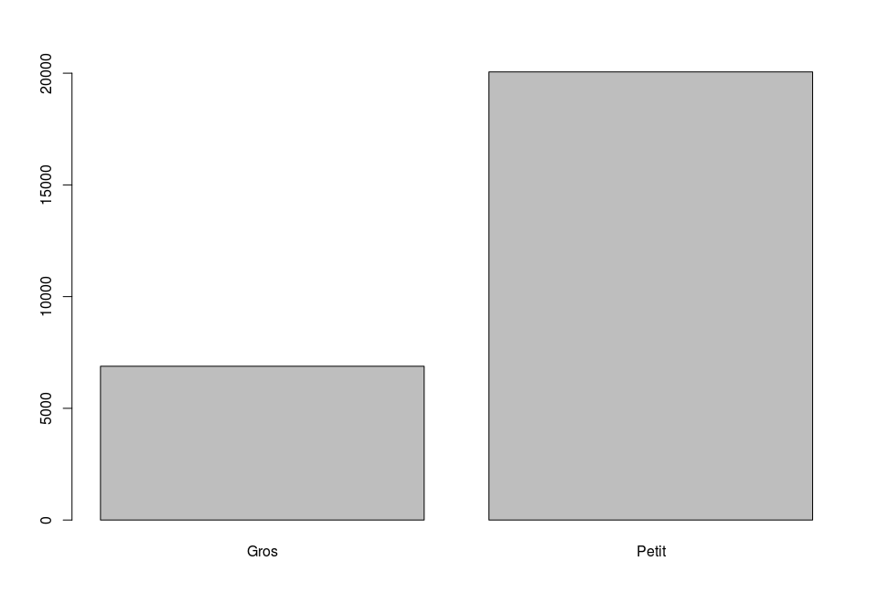

# Quelques bases pour utiliser R
Joël Gombin  
12 janvier 2016  


## Comment trouver de l'aide ?

- `help(foo)` ou `?foo` dans R (`??foo` si on veut chercher parmi tous les packages)
- chercher en ligne, par exemple dans [RDocumentation](http://www.rdocumentation.org)
- de fait, [Stackoverflow](http://stackoverflow.com/questions/tagged/r) devient une source majeure d'aide 
- les [meetups R](http://www.meetup.com/rparis/) sont souvent assez cools.
- lire les blogs : agrégés sur [RBloggers](http://www.r-bloggers.com)
- Manuels en ligne et en français : 
- PARADIS E., [*R pour les débutants*](http://cran.r-project.org/doc/contrib/Paradis-rdebuts_fr.pdf)
- BARNIER J., [*R pour les sociologues*](https://alea.fr.eu.org/pages/intro-R)
- Groupe ElementR, [*R et espace*](http://framabook.org/r-et-espace/)
- etc.

## [RStudio](rstudio.com): votre meilleur ami !

Environnement de développement (IDE) et interface graphique (GUI). Équipe de développement extrêmement dynamique et compétente. 

## Lire et écrire du code

- Créer des objets ou afficher des résultats : l'opérateur d'assignation (`=` ou plus généralement `<-`)

- Lire de droite à gauche.


```r
y <- f(x)
```

- Lire du centre vers la périphérie (ou mieux, utiliser des _pipes_ !).


```r
# charger un fichier csv
eur14ParisBV <- read.csv("./data/européennes2014ParisBV.csv", header = TRUE, sep = ";", stringsAsFactors = FALSE)

# pour lire des gros fichiers, préférer le package readr et la fonction read_csv

# autre opérateur d'assignation

a = 4

# Voir le nom des variables
names(eur14ParisBV)
```

```
##  [1] "CodeArrdt"    "CodeBV"       "CodeCirco"    "CodeInsee"   
##  [5] "Inscrits"     "Votants"      "Exprimés"     "Liste"       
##  [9] "Voix"         "Blancs"       "Nuls"         "Procurations"
```

```r
# Voir les premières lignes du dataframe 
head(eur14ParisBV)
```

```
##   CodeArrdt CodeBV CodeCirco CodeInsee Inscrits Votants Exprimés
## 1         1      1         1     75101     1052     595      587
## 2         1      1         1     75101     1052     595      587
## 3         1      1         1     75101     1052     595      587
## 4         1      1         1     75101     1052     595      587
## 5         1      1         1     75101     1052     595      587
## 6         1      1         1     75101     1052     595      587
##        Liste Voix Blancs Nuls Procurations
## 1 LE SCORNET    0      7    1           29
## 2     BORDRY   23      7    1           29
## 3      TOPLA    0      7    1           29
## 4     DURAND   60      7    1           29
## 5   VOLGANLI    1      7    1           29
## 6 GHEIOUECHE    7      7    1           29
```

```r
# Voir les dernières lignes du dataframe
tail(eur14ParisBV)
```

```
##       CodeArrdt CodeBV CodeCirco CodeInsee Inscrits Votants Exprimés
## 26934        20     76         6     75120     1592     672      655
## 26935        20     76         6     75120     1592     672      655
## 26936        20     76         6     75120     1592     672      655
## 26937        20     76         6     75120     1592     672      655
## 26938        20     76         6     75120     1592     672      655
## 26939        20     76         6     75120     1592     672      655
##                           Liste Voix Blancs Nuls Procurations
## 26934               LARROUTUROU   30     14    3           29
## 26935                    LEPAGE   12     14    3           29
## 26936 DE GOUYON MATIGNON DE PON    0     14    3           29
## 26937                    BOUTIN    2     14    3           29
## 26938                 CHAUPRADE   41     14    3           29
## 26939                BESANCENOT    7     14    3           29
```

- Pourquoi coder au lieu de cliquer ?
Reproducibilité, économies d'échelle, documentation de la recherche : ["reproducible research"](https://cran.r-project.org/web/views/ReproducibleResearch.html)

- Pour qui coder ? Lisibilité, conventions d'écriture et documentation
Avant tout soi-même... plus tard ! 

## Les objets 

Dans R, tout est objet (ou fonction, mais les fonctions elles-mêmes sont des objets...). Ces objets, plus ou moins complexes, possèdent une classe. 

### Les types de base

- `integer`
- `numeric`
- `character`

### Les classes de base

- `vector` : dans R, le vecteur est roi : on cherche systématiquement à vectoriser les calculs
- `factor` : variable catégorielle
- `matrix` et `array` : matrice ou tableau multidimensionnel ; ne contient que des `integer` ou `numeric`
- `list` : une liste d'objets quelconques, sans structure particulière (similaire au `json`)
- `data.frame` : un tableau de données, qui peuvent être numériques, des `character` ou des `factor` (ou autre : listes, `data.frames`...)

### Les autres classes

À partir de ces objets élémentaires, on peut construire toutes sortes d'objets complexes (dont des objets spatiaux !). Ce type d'objet est défini par une _classe_, qui définit la _structure_ des objets et les _méthodes_ (fonctions) qu'on peut leur appliquer. 

Dans la plupart des cas, on n'a pas trop à se soucier des classes dans R, on se contente d'utiliser des fonctions standard ("génériques") qui savent quoi faire selon la classe de l'objet considéré (ex : `plot`, `summary`, `print`...).

## Importer et exporter des données

- Fonctions de type `read.format()` pour la lecture et `write.format()` pour l'écriture
- Fichiers texte (.txt ou .csv) : `read.table()`, `read.csv()` (ou package `readr`)
- Fichiers Excel (.xls ou .xlsx) : `read.xls()` du package `gdata`, package `readxl` (mais à éviter : sauver en CSV !)
- Fichiers SAS, SPSS, Stata etc. : fonctions du package `foreign` (ou, mieux, du package `haven`)
- Formats de stockage de R (.RData) : fonctions `save()` et `load()`
- Bases de données externes (PostgreSQL, SQLite, etc.) : packages dédiés ou interface unifiée par le package `dplyr`

Si on ne veut pas trop se poser de question : le package `rio` propose une interface unifiée pour [la plupart des formats](https://cran.r-project.org/web/packages/rio/vignettes/rio.html). 

## Manipuler les données


```r
## examiner la structure d'un objet

str(eur14ParisBV)
```

```
## 'data.frame':	26939 obs. of  12 variables:
##  $ CodeArrdt   : int  1 1 1 1 1 1 1 1 1 1 ...
##  $ CodeBV      : int  1 1 1 1 1 1 1 1 1 1 ...
##  $ CodeCirco   : int  1 1 1 1 1 1 1 1 1 1 ...
##  $ CodeInsee   : int  75101 75101 75101 75101 75101 75101 75101 75101 75101 75101 ...
##  $ Inscrits    : int  1052 1052 1052 1052 1052 1052 1052 1052 1052 1052 ...
##  $ Votants     : int  595 595 595 595 595 595 595 595 595 595 ...
##  $ Exprimés    : int  587 587 587 587 587 587 587 587 587 587 ...
##  $ Liste       : chr  "LE SCORNET" "BORDRY" "TOPLA" "DURAND" ...
##  $ Voix        : int  0 23 0 60 1 7 137 0 0 0 ...
##  $ Blancs      : int  7 7 7 7 7 7 7 7 7 7 ...
##  $ Nuls        : int  1 1 1 1 1 1 1 1 1 1 ...
##  $ Procurations: int  29 29 29 29 29 29 29 29 29 29 ...
```

```r
## avoir un résumé d'un objet

summary(eur14ParisBV)
```

```
##    CodeArrdt         CodeBV        CodeCirco        CodeInsee    
##  Min.   : 1.00   Min.   : 1.00   Min.   : 1.000   Min.   :75101  
##  1st Qu.:11.00   1st Qu.:11.00   1st Qu.: 5.000   1st Qu.:75111  
##  Median :14.00   Median :25.00   Median : 9.000   Median :75114  
##  Mean   :13.56   Mean   :29.71   Mean   : 9.232   Mean   :75114  
##  3rd Qu.:17.00   3rd Qu.:46.00   3rd Qu.:14.000   3rd Qu.:75117  
##  Max.   :20.00   Max.   :95.00   Max.   :18.000   Max.   :75120  
##     Inscrits       Votants          Exprimés         Liste          
##  Min.   : 745   Min.   : 274.0   Min.   : 265.0   Length:26939      
##  1st Qu.:1304   1st Qu.: 656.0   1st Qu.: 644.0   Class :character  
##  Median :1407   Median : 741.0   Median : 729.0   Mode  :character  
##  Mean   :1394   Mean   : 727.7   Mean   : 715.7                     
##  3rd Qu.:1502   3rd Qu.: 818.0   3rd Qu.: 805.0                     
##  Max.   :1848   Max.   :1049.0   Max.   :1034.0                     
##       Voix            Blancs            Nuls         Procurations  
##  Min.   :  0.00   Min.   : 0.000   Min.   : 0.000   Min.   : 0.00  
##  1st Qu.:  0.00   1st Qu.: 5.000   1st Qu.: 2.000   1st Qu.:19.00  
##  Median :  3.00   Median : 8.000   Median : 4.000   Median :26.00  
##  Mean   : 23.09   Mean   : 8.102   Mean   : 3.869   Mean   :26.09  
##  3rd Qu.: 18.00   3rd Qu.:10.000   3rd Qu.: 5.000   3rd Qu.:33.00  
##  Max.   :441.00   Max.   :23.000   Max.   :13.000   Max.   :73.00
```

```r
## désigner une variable au sein d'un data.frame

head(eur14ParisBV$CodeInsee)
```

```
## [1] 75101 75101 75101 75101 75101 75101
```

```r
## ou encore

head(eur14ParisBV[,"CodeInsee"])
```

```
## [1] 75101 75101 75101 75101 75101 75101
```

```r
## récupérer certaines lignes

eur14ParisBV[1:5,]
```

```
##   CodeArrdt CodeBV CodeCirco CodeInsee Inscrits Votants Exprimés
## 1         1      1         1     75101     1052     595      587
## 2         1      1         1     75101     1052     595      587
## 3         1      1         1     75101     1052     595      587
## 4         1      1         1     75101     1052     595      587
## 5         1      1         1     75101     1052     595      587
##        Liste Voix Blancs Nuls Procurations
## 1 LE SCORNET    0      7    1           29
## 2     BORDRY   23      7    1           29
## 3      TOPLA    0      7    1           29
## 4     DURAND   60      7    1           29
## 5   VOLGANLI    1      7    1           29
```

```r
## ou encore

eur14ParisBV[c(1,2,4,9),]
```

```
##   CodeArrdt CodeBV CodeCirco CodeInsee Inscrits Votants Exprimés
## 1         1      1         1     75101     1052     595      587
## 2         1      1         1     75101     1052     595      587
## 4         1      1         1     75101     1052     595      587
## 9         1      1         1     75101     1052     595      587
##        Liste Voix Blancs Nuls Procurations
## 1 LE SCORNET    0      7    1           29
## 2     BORDRY   23      7    1           29
## 4     DURAND   60      7    1           29
## 9   PAILLARD    0      7    1           29
```

```r
## on peut évidemment combiner sélection de ligne et de variable

eur14ParisBV[1:5, "Liste"]
```

```
## [1] "LE SCORNET" "BORDRY"     "TOPLA"      "DURAND"     "VOLGANLI"
```

```r
eur14ParisBV[1:5, c("Liste", "Voix")]
```

```
##        Liste Voix
## 1 LE SCORNET    0
## 2     BORDRY   23
## 3      TOPLA    0
## 4     DURAND   60
## 5   VOLGANLI    1
```

```r
eur14ParisBV[1:5, c(8,9)]
```

```
##        Liste Voix
## 1 LE SCORNET    0
## 2     BORDRY   23
## 3      TOPLA    0
## 4     DURAND   60
## 5   VOLGANLI    1
```

```r
## Là où ça devient vraiment intéressant, c'est quand on fait de la sélection conditionnelle...

head(eur14ParisBV[eur14ParisBV$Inscrits > 1500, c("CodeBV", "CodeInsee", "Voix")])
```

```
##     CodeBV CodeInsee Voix
## 528      8     75102    0
## 529      8     75102   18
## 530      8     75102    0
## 531      8     75102  175
## 532      8     75102    4
## 533      8     75102    9
```

## _Oui, mais M'sieur, c'est illisible votre truc..._

C'est vrai ! On peut utiliser une syntaxe plus moderne et, surtout, plus lisible grâce au package `dplyr` de Hadley Wickham.


```r
# si le package n'est pas installé :
  
  # install.packages("dplyr")
  
  ## on commence par charger le package grâce à la fonction library
  
  library(dplyr)
```

```
## 
## Attaching package: 'dplyr'
## 
## The following objects are masked from 'package:stats':
## 
##     filter, lag
## 
## The following objects are masked from 'package:base':
## 
##     intersect, setdiff, setequal, union
```

```r
## on peut maintenant créer un pipe de données, qui se lit de gauche à droite

eur14ParisBV %>%
  filter(Inscrits > 1500) %>%
  select(CodeBV, CodeInsee, Voix) %>%
  glimpse()
```

```
## Observations: 6,882
## Variables: 3
## $ CodeBV    (int) 8, 8, 8, 8, 8, 8, 8, 8, 8, 8, 8, 8, 8, 8, 8, 8, 8, 8...
## $ CodeInsee (int) 75102, 75102, 75102, 75102, 75102, 75102, 75102, 751...
## $ Voix      (int) 0, 18, 0, 175, 4, 9, 117, 0, 0, 1, 103, 0, 0, 12, 5,...
```

```r
## et si on veut modifier nos données, alors ?

eur14ParisBV <- eur14ParisBV %>%
  mutate(Abstention = Inscrits - Votants)

eur14ParisBV %>% glimpse()
```

```
## Observations: 26,939
## Variables: 13
## $ CodeArrdt    (int) 1, 1, 1, 1, 1, 1, 1, 1, 1, 1, 1, 1, 1, 1, 1, 1, 1...
## $ CodeBV       (int) 1, 1, 1, 1, 1, 1, 1, 1, 1, 1, 1, 1, 1, 1, 1, 1, 1...
## $ CodeCirco    (int) 1, 1, 1, 1, 1, 1, 1, 1, 1, 1, 1, 1, 1, 1, 1, 1, 1...
## $ CodeInsee    (int) 75101, 75101, 75101, 75101, 75101, 75101, 75101, ...
## $ Inscrits     (int) 1052, 1052, 1052, 1052, 1052, 1052, 1052, 1052, 1...
## $ Votants      (int) 595, 595, 595, 595, 595, 595, 595, 595, 595, 595,...
## $ Exprimés     (int) 587, 587, 587, 587, 587, 587, 587, 587, 587, 587,...
## $ Liste        (chr) "LE SCORNET", "BORDRY", "TOPLA", "DURAND", "VOLGA...
## $ Voix         (int) 0, 23, 0, 60, 1, 7, 137, 0, 0, 0, 91, 0, 0, 15, 7...
## $ Blancs       (int) 7, 7, 7, 7, 7, 7, 7, 7, 7, 7, 7, 7, 7, 7, 7, 7, 7...
## $ Nuls         (int) 1, 1, 1, 1, 1, 1, 1, 1, 1, 1, 1, 1, 1, 1, 1, 1, 1...
## $ Procurations (int) 29, 29, 29, 29, 29, 29, 29, 29, 29, 29, 29, 29, 2...
## $ Abstention   (int) 457, 457, 457, 457, 457, 457, 457, 457, 457, 457,...
```

```r
eur14ParisBV %>%
  mutate(taille = ifelse(Inscrits > 1500, 
                         "Gros",
                         "Petit")
  ) %>%
  select(taille) %>%
  table()
```

```
## .
##  Gros Petit 
##  6882 20057
```

```r
eur14ParisBV %>%
  mutate(taille = ifelse(Inscrits > 1500, 
                         "Gros",
                         "Petit")
  ) %>%
  select(taille) %>%
  table() %>%
  barplot()
```

\ 

Notre jeu de données a un problème : on a une ligne par candidat. Il nous faut le passer en format "normal", avec une colonne par candidat. Dans Excel, on ferait un tableau croisé dynamique... et dans R ?

Il y a plusieurs manières de faire ça. La plus moderne (et simple !) est sans doute la suivante :
  

```r
# il faut installer tidyr si ce n'est pas fait :
# install.packages("tidyr")

# on charge le package tidyr
library(tidyr)

## testons avant de modifier le dataset...

eur14ParisBV %>% 
  spread(Liste, Voix) %>%
  head()
```

```
##   CodeArrdt CodeBV CodeCirco CodeInsee Inscrits Votants Exprimés Blancs
## 1         1      1         1     75101     1052     595      587      7
## 2         1      2         1     75101     1061     582      573      7
## 3         1      3         1     75101     1081     561      553      6
## 4         1      4         1     75101     1245     635      624     11
## 5         1      5         1     75101      969     527      524      3
## 6         1      6         1     75101     1032     578      566      7
##   Nuls Procurations Abstention ARTHAUD ASSELINEAU BERÈS BESANCENOT BORDRY
## 1    1           29        457       4          1    96          2     23
## 2    2           24        479       1          1   102          3     19
## 3    2           29        520       1          2   124          3     15
## 4    0           32        610       5          1    99          5      9
## 5    0           21        442       2          0   118          2      9
## 6    5           13        454       4          3   112          4     21
##   BOUTIN CHAUPRADE DE GOUYON MATIGNON DE PON DE HAAS DELANOË DE SARNEZ
## 1     16        73                         0       1       0        91
## 2      2        57                         1       2       0        81
## 3      4        56                         0       4       0        74
## 4      3        53                         1       3       0        70
## 5      6        52                         0       4       0        68
## 6      4        52                         0       2       0        82
##   DURAND FEO GHEIOUECHE GOVERNATORI GRIMAL GUYOT JAMET LAMASSOURE
## 1     60   0          7           4      0     7    15        137
## 2     78   0          2           3      0     2    13        133
## 3     74   0          7          14      0     3    14         98
## 4    108   1          7          13      0     3    14        137
## 5     77   0          2           5      0     2     6        119
## 6     69   1          3           7      0     1    11        136
##   LARROUTUROU LE HYARIC LEPAGE LEPAPE LE SCORNET MAYEROWITZ MBELLA
## 1          16        19     14      0          0          0      0
## 2          24        23     18      0          0          1      0
## 3          17        28      7      0          0          0      0
## 4          28        36     17      0          0          0      0
## 5          19        21     10      0          0          0      0
## 6          12        18     21      0          0          0      0
##   PAILLARD PATAS D'ILLIERS TOPLA VERMOREL VOLGANLI
## 1        0               0     0        0        1
## 2        0               0     1        4        2
## 3        0               0     0        8        0
## 4        0               0     3        8        0
## 5        0               2     0        0        0
## 6        0               0     1        0        2
```

```r
## on vérifie que le nombre de lignes est correct

eur14ParisBV %>% 
  spread(Liste, Voix) %>%
  nrow()
```

```
## [1] 869
```

```r
## BOUM ! ça marche. Modifions le dataset :

eur14ParisBV <- eur14ParisBV %>% 
  spread(Liste, Voix)

## On peut maintenant calculer les scores en % des inscrits :

eur14ParisBVins <- eur14ParisBV %>%
  mutate_each(funs(. / Inscrits * 100), ARTHAUD:VOLGANLI)

eur14ParisBVins %>%
  glimpse()
```

```
## Observations: 869
## Variables: 42
## $ CodeArrdt                 (int) 1, 1, 1, 1, 1, 1, 1, 1, 1, 1, 2, 2, ...
## $ CodeBV                    (int) 1, 2, 3, 4, 5, 6, 7, 8, 9, 10, 1, 2,...
## $ CodeCirco                 (int) 1, 1, 1, 1, 1, 1, 1, 1, 1, 1, 1, 1, ...
## $ CodeInsee                 (int) 75101, 75101, 75101, 75101, 75101, 7...
## $ Inscrits                  (int) 1052, 1061, 1081, 1245, 969, 1032, 1...
## $ Votants                   (int) 595, 582, 561, 635, 527, 578, 606, 4...
## $ Exprimés                  (int) 587, 573, 553, 624, 524, 566, 600, 4...
## $ Blancs                    (int) 7, 7, 6, 11, 3, 7, 6, 4, 2, 5, 5, 7,...
## $ Nuls                      (int) 1, 2, 2, 0, 0, 5, 0, 1, 2, 2, 0, 1, ...
## $ Procurations              (int) 29, 24, 29, 32, 21, 13, 26, 18, 32, ...
## $ Abstention                (int) 457, 479, 520, 610, 442, 454, 455, 4...
## $ ARTHAUD                   (dbl) 0.38022814, 0.09425071, 0.09250694, ...
## $ ASSELINEAU                (dbl) 0.09505703, 0.09425071, 0.18501388, ...
## $ BERÈS                     (dbl) 9.125475, 9.613572, 11.470860, 7.951...
## $ BESANCENOT                (dbl) 0.19011407, 0.28275212, 0.27752081, ...
## $ BORDRY                    (dbl) 2.1863118, 1.7907634, 1.3876041, 0.7...
## $ BOUTIN                    (dbl) 1.5209125, 0.1885014, 0.3700278, 0.2...
## $ CHAUPRADE                 (dbl) 6.939163, 5.372290, 5.180389, 4.2570...
## $ DE GOUYON MATIGNON DE PON (dbl) 0.00000000, 0.09425071, 0.00000000, ...
## $ DE HAAS                   (dbl) 0.09505703, 0.18850141, 0.37002775, ...
## $ DELANOË                   (dbl) 0, 0, 0, 0, 0, 0, 0, 0, 0, 0, 0, 0, ...
## $ DE SARNEZ                 (dbl) 8.650190, 7.634307, 6.845513, 5.6224...
## $ DURAND                    (dbl) 5.703422, 7.351555, 6.845513, 8.6746...
## $ FEO                       (dbl) 0.00000000, 0.00000000, 0.00000000, ...
## $ GHEIOUECHE                (dbl) 0.66539924, 0.18850141, 0.64754857, ...
## $ GOVERNATORI               (dbl) 0.3802281, 0.2827521, 1.2950971, 1.0...
## $ GRIMAL                    (dbl) 0.0000000, 0.0000000, 0.0000000, 0.0...
## $ GUYOT                     (dbl) 0.66539924, 0.18850141, 0.27752081, ...
## $ JAMET                     (dbl) 1.4258555, 1.2252592, 1.2950971, 1.1...
## $ LAMASSOURE                (dbl) 13.022814, 12.535344, 9.065680, 11.0...
## $ LARROUTUROU               (dbl) 1.5209125, 2.2620170, 1.5726179, 2.2...
## $ LE HYARIC                 (dbl) 1.8060837, 2.1677663, 2.5901943, 2.8...
## $ LEPAGE                    (dbl) 1.3307985, 1.6965127, 0.6475486, 1.3...
## $ LEPAPE                    (dbl) 0.00000000, 0.00000000, 0.00000000, ...
## $ LE SCORNET                (dbl) 0, 0, 0, 0, 0, 0, 0, 0, 0, 0, 0, 0, ...
## $ MAYEROWITZ                (dbl) 0.00000000, 0.09425071, 0.00000000, ...
## $ MBELLA                    (dbl) 0.00000000, 0.00000000, 0.00000000, ...
## $ PAILLARD                  (dbl) 0.00000000, 0.00000000, 0.00000000, ...
## $ PATAS D'ILLIERS           (dbl) 0.00000000, 0.00000000, 0.00000000, ...
## $ TOPLA                     (dbl) 0.00000000, 0.09425071, 0.00000000, ...
## $ VERMOREL                  (dbl) 0.0000000, 0.3770028, 0.7400555, 0.6...
## $ VOLGANLI                  (dbl) 0.09505703, 0.18850141, 0.00000000, ...
```

```r
## ou en % des exprimés !

eur14ParisBVexp <- eur14ParisBV %>%
  mutate_each(funs(. / Exprimés * 100), ARTHAUD:VOLGANLI)

eur14ParisBVexp %>%
  glimpse()
```

```
## Observations: 869
## Variables: 42
## $ CodeArrdt                 (int) 1, 1, 1, 1, 1, 1, 1, 1, 1, 1, 2, 2, ...
## $ CodeBV                    (int) 1, 2, 3, 4, 5, 6, 7, 8, 9, 10, 1, 2,...
## $ CodeCirco                 (int) 1, 1, 1, 1, 1, 1, 1, 1, 1, 1, 1, 1, ...
## $ CodeInsee                 (int) 75101, 75101, 75101, 75101, 75101, 7...
## $ Inscrits                  (int) 1052, 1061, 1081, 1245, 969, 1032, 1...
## $ Votants                   (int) 595, 582, 561, 635, 527, 578, 606, 4...
## $ Exprimés                  (int) 587, 573, 553, 624, 524, 566, 600, 4...
## $ Blancs                    (int) 7, 7, 6, 11, 3, 7, 6, 4, 2, 5, 5, 7,...
## $ Nuls                      (int) 1, 2, 2, 0, 0, 5, 0, 1, 2, 2, 0, 1, ...
## $ Procurations              (int) 29, 24, 29, 32, 21, 13, 26, 18, 32, ...
## $ Abstention                (int) 457, 479, 520, 610, 442, 454, 455, 4...
## $ ARTHAUD                   (dbl) 0.6814310, 0.1745201, 0.1808318, 0.8...
## $ ASSELINEAU                (dbl) 0.1703578, 0.1745201, 0.3616637, 0.1...
## $ BERÈS                     (dbl) 16.35434, 17.80105, 22.42315, 15.865...
## $ BESANCENOT                (dbl) 0.3407155, 0.5235602, 0.5424955, 0.8...
## $ BORDRY                    (dbl) 3.9182283, 3.3158813, 2.7124774, 1.4...
## $ BOUTIN                    (dbl) 2.7257240, 0.3490401, 0.7233273, 0.4...
## $ CHAUPRADE                 (dbl) 12.436116, 9.947644, 10.126582, 8.49...
## $ DE GOUYON MATIGNON DE PON (dbl) 0.0000000, 0.1745201, 0.0000000, 0.1...
## $ DE HAAS                   (dbl) 0.1703578, 0.3490401, 0.7233273, 0.4...
## $ DELANOË                   (dbl) 0, 0, 0, 0, 0, 0, 0, 0, 0, 0, 0, 0, ...
## $ DE SARNEZ                 (dbl) 15.50256, 14.13613, 13.38156, 11.217...
## $ DURAND                    (dbl) 10.221465, 13.612565, 13.381555, 17....
## $ FEO                       (dbl) 0.0000000, 0.0000000, 0.0000000, 0.1...
## $ GHEIOUECHE                (dbl) 1.1925043, 0.3490401, 1.2658228, 1.1...
## $ GOVERNATORI               (dbl) 0.6814310, 0.5235602, 2.5316456, 2.0...
## $ GRIMAL                    (dbl) 0.0000000, 0.0000000, 0.0000000, 0.0...
## $ GUYOT                     (dbl) 1.1925043, 0.3490401, 0.5424955, 0.4...
## $ JAMET                     (dbl) 2.555366, 2.268761, 2.531646, 2.2435...
## $ LAMASSOURE                (dbl) 23.33901, 23.21117, 17.72152, 21.955...
## $ LARROUTUROU               (dbl) 2.725724, 4.188482, 3.074141, 4.4871...
## $ LE HYARIC                 (dbl) 3.2367973, 4.0139616, 5.0632911, 5.7...
## $ LEPAGE                    (dbl) 2.385009, 3.141361, 1.265823, 2.7243...
## $ LEPAPE                    (dbl) 0.0000000, 0.0000000, 0.0000000, 0.0...
## $ LE SCORNET                (dbl) 0, 0, 0, 0, 0, 0, 0, 0, 0, 0, 0, 0, ...
## $ MAYEROWITZ                (dbl) 0.0000000, 0.1745201, 0.0000000, 0.0...
## $ MBELLA                    (dbl) 0.0000000, 0.0000000, 0.0000000, 0.0...
## $ PAILLARD                  (dbl) 0.0000000, 0.0000000, 0.0000000, 0.0...
## $ PATAS D'ILLIERS           (dbl) 0.0000000, 0.0000000, 0.0000000, 0.0...
## $ TOPLA                     (dbl) 0.0000000, 0.1745201, 0.0000000, 0.4...
## $ VERMOREL                  (dbl) 0.0000000, 0.6980803, 1.4466546, 1.2...
## $ VOLGANLI                  (dbl) 0.1703578, 0.3490401, 0.0000000, 0.0...
```

```r
## mettre tout dans le même dataframe est (pour l'instant) un peu tricky :

eur14ParisBVTout <- eur14ParisBV
eur14ParisBVTout[,paste0(names(eur14ParisBVins)[11:41], ".ins")] <- eur14ParisBVins[,11:41]
eur14ParisBVTout[,paste0(names(eur14ParisBVexp)[11:41], ".exp")] <- eur14ParisBVexp[,11:41]

head(eur14ParisBVTout)
```

```
##   CodeArrdt CodeBV CodeCirco CodeInsee Inscrits Votants Exprimés Blancs
## 1         1      1         1     75101     1052     595      587      7
## 2         1      2         1     75101     1061     582      573      7
## 3         1      3         1     75101     1081     561      553      6
## 4         1      4         1     75101     1245     635      624     11
## 5         1      5         1     75101      969     527      524      3
## 6         1      6         1     75101     1032     578      566      7
##   Nuls Procurations Abstention ARTHAUD ASSELINEAU BERÈS BESANCENOT BORDRY
## 1    1           29        457       4          1    96          2     23
## 2    2           24        479       1          1   102          3     19
## 3    2           29        520       1          2   124          3     15
## 4    0           32        610       5          1    99          5      9
## 5    0           21        442       2          0   118          2      9
## 6    5           13        454       4          3   112          4     21
##   BOUTIN CHAUPRADE DE GOUYON MATIGNON DE PON DE HAAS DELANOË DE SARNEZ
## 1     16        73                         0       1       0        91
## 2      2        57                         1       2       0        81
## 3      4        56                         0       4       0        74
## 4      3        53                         1       3       0        70
## 5      6        52                         0       4       0        68
## 6      4        52                         0       2       0        82
##   DURAND FEO GHEIOUECHE GOVERNATORI GRIMAL GUYOT JAMET LAMASSOURE
## 1     60   0          7           4      0     7    15        137
## 2     78   0          2           3      0     2    13        133
## 3     74   0          7          14      0     3    14         98
## 4    108   1          7          13      0     3    14        137
## 5     77   0          2           5      0     2     6        119
## 6     69   1          3           7      0     1    11        136
##   LARROUTUROU LE HYARIC LEPAGE LEPAPE LE SCORNET MAYEROWITZ MBELLA
## 1          16        19     14      0          0          0      0
## 2          24        23     18      0          0          1      0
## 3          17        28      7      0          0          0      0
## 4          28        36     17      0          0          0      0
## 5          19        21     10      0          0          0      0
## 6          12        18     21      0          0          0      0
##   PAILLARD PATAS D'ILLIERS TOPLA VERMOREL VOLGANLI Abstention.ins
## 1        0               0     0        0        1            457
## 2        0               0     1        4        2            479
## 3        0               0     0        8        0            520
## 4        0               0     3        8        0            610
## 5        0               2     0        0        0            442
## 6        0               0     1        0        2            454
##   ARTHAUD.ins ASSELINEAU.ins BERÈS.ins BESANCENOT.ins BORDRY.ins
## 1  0.38022814     0.09505703  9.125475      0.1901141  2.1863118
## 2  0.09425071     0.09425071  9.613572      0.2827521  1.7907634
## 3  0.09250694     0.18501388 11.470860      0.2775208  1.3876041
## 4  0.40160643     0.08032129  7.951807      0.4016064  0.7228916
## 5  0.20639835     0.00000000 12.177503      0.2063983  0.9287926
## 6  0.38759690     0.29069767 10.852713      0.3875969  2.0348837
##   BOUTIN.ins CHAUPRADE.ins DE GOUYON MATIGNON DE PON.ins DE HAAS.ins
## 1  1.5209125      6.939163                    0.00000000  0.09505703
## 2  0.1885014      5.372290                    0.09425071  0.18850141
## 3  0.3700278      5.180389                    0.00000000  0.37002775
## 4  0.2409639      4.257028                    0.08032129  0.24096386
## 5  0.6191950      5.366357                    0.00000000  0.41279670
## 6  0.3875969      5.038760                    0.00000000  0.19379845
##   DELANOË.ins DE SARNEZ.ins DURAND.ins    FEO.ins GHEIOUECHE.ins
## 1           0      8.650190   5.703422 0.00000000      0.6653992
## 2           0      7.634307   7.351555 0.00000000      0.1885014
## 3           0      6.845513   6.845513 0.00000000      0.6475486
## 4           0      5.622490   8.674699 0.08032129      0.5622490
## 5           0      7.017544   7.946336 0.00000000      0.2063983
## 6           0      7.945736   6.686047 0.09689922      0.2906977
##   GOVERNATORI.ins GRIMAL.ins  GUYOT.ins JAMET.ins LAMASSOURE.ins
## 1       0.3802281          0 0.66539924  1.425856       13.02281
## 2       0.2827521          0 0.18850141  1.225259       12.53534
## 3       1.2950971          0 0.27752081  1.295097        9.06568
## 4       1.0441767          0 0.24096386  1.124498       11.00402
## 5       0.5159959          0 0.20639835  0.619195       12.28070
## 6       0.6782946          0 0.09689922  1.065891       13.17829
##   LARROUTUROU.ins LE HYARIC.ins LEPAGE.ins LEPAPE.ins LE SCORNET.ins
## 1        1.520913      1.806084  1.3307985          0              0
## 2        2.262017      2.167766  1.6965127          0              0
## 3        1.572618      2.590194  0.6475486          0              0
## 4        2.248996      2.891566  1.3654618          0              0
## 5        1.960784      2.167183  1.0319917          0              0
## 6        1.162791      1.744186  2.0348837          0              0
##   MAYEROWITZ.ins MBELLA.ins PAILLARD.ins PATAS D'ILLIERS.ins  TOPLA.ins
## 1     0.00000000          0            0           0.0000000 0.00000000
## 2     0.09425071          0            0           0.0000000 0.09425071
## 3     0.00000000          0            0           0.0000000 0.00000000
## 4     0.00000000          0            0           0.0000000 0.24096386
## 5     0.00000000          0            0           0.2063983 0.00000000
## 6     0.00000000          0            0           0.0000000 0.09689922
##   VERMOREL.ins Abstention.exp ARTHAUD.exp ASSELINEAU.exp BERÈS.exp
## 1    0.0000000            457   0.6814310      0.1703578  16.35434
## 2    0.3770028            479   0.1745201      0.1745201  17.80105
## 3    0.7400555            520   0.1808318      0.3616637  22.42315
## 4    0.6425703            610   0.8012821      0.1602564  15.86538
## 5    0.0000000            442   0.3816794      0.0000000  22.51908
## 6    0.0000000            454   0.7067138      0.5300353  19.78799
##   BESANCENOT.exp BORDRY.exp BOUTIN.exp CHAUPRADE.exp
## 1      0.3407155   3.918228  2.7257240     12.436116
## 2      0.5235602   3.315881  0.3490401      9.947644
## 3      0.5424955   2.712477  0.7233273     10.126582
## 4      0.8012821   1.442308  0.4807692      8.493590
## 5      0.3816794   1.717557  1.1450382      9.923664
## 6      0.7067138   3.710247  0.7067138      9.187279
##   DE GOUYON MATIGNON DE PON.exp DE HAAS.exp DELANOË.exp DE SARNEZ.exp
## 1                     0.0000000   0.1703578           0      15.50256
## 2                     0.1745201   0.3490401           0      14.13613
## 3                     0.0000000   0.7233273           0      13.38156
## 4                     0.1602564   0.4807692           0      11.21795
## 5                     0.0000000   0.7633588           0      12.97710
## 6                     0.0000000   0.3533569           0      14.48763
##   DURAND.exp   FEO.exp GHEIOUECHE.exp GOVERNATORI.exp GRIMAL.exp GUYOT.exp
## 1   10.22147 0.0000000      1.1925043       0.6814310          0 1.1925043
## 2   13.61257 0.0000000      0.3490401       0.5235602          0 0.3490401
## 3   13.38156 0.0000000      1.2658228       2.5316456          0 0.5424955
## 4   17.30769 0.1602564      1.1217949       2.0833333          0 0.4807692
## 5   14.69466 0.0000000      0.3816794       0.9541985          0 0.3816794
## 6   12.19081 0.1766784      0.5300353       1.2367491          0 0.1766784
##   JAMET.exp LAMASSOURE.exp LARROUTUROU.exp LE HYARIC.exp LEPAGE.exp
## 1  2.555366       23.33901        2.725724      3.236797   2.385009
## 2  2.268761       23.21117        4.188482      4.013962   3.141361
## 3  2.531646       17.72152        3.074141      5.063291   1.265823
## 4  2.243590       21.95513        4.487179      5.769231   2.724359
## 5  1.145038       22.70992        3.625954      4.007634   1.908397
## 6  1.943463       24.02827        2.120141      3.180212   3.710247
##   LEPAPE.exp LE SCORNET.exp MAYEROWITZ.exp MBELLA.exp PAILLARD.exp
## 1          0              0      0.0000000          0            0
## 2          0              0      0.1745201          0            0
## 3          0              0      0.0000000          0            0
## 4          0              0      0.0000000          0            0
## 5          0              0      0.0000000          0            0
## 6          0              0      0.0000000          0            0
##   PATAS D'ILLIERS.exp TOPLA.exp VERMOREL.exp
## 1           0.0000000 0.0000000    0.0000000
## 2           0.0000000 0.1745201    0.6980803
## 3           0.0000000 0.0000000    1.4466546
## 4           0.0000000 0.4807692    1.2820513
## 5           0.3816794 0.0000000    0.0000000
## 6           0.0000000 0.1766784    0.0000000
```

```r
## Et si on veut regrouper les données par arrondissement ?

eur14ParisBVArrdt <- eur14ParisBV %>%
  group_by(CodeInsee) %>%
  summarise_each(funs(sum(.)), Inscrits:VOLGANLI)

eur14ParisBVArrdt %>%
  glimpse()
```

```
## Observations: 20
## Variables: 39
## $ CodeInsee                 (int) 75101, 75102, 75103, 75104, 75105, 7...
## $ Inscrits                  (int) 10110, 11893, 19876, 16758, 34459, 2...
## $ Votants                   (int) 5503, 6257, 11012, 9346, 20780, 1438...
## $ Exprimés                  (int) 5430, 6173, 10877, 9221, 20500, 1424...
## $ Blancs                    (int) 58, 63, 101, 90, 194, 113, 128, 78, ...
## $ Nuls                      (int) 15, 21, 34, 35, 86, 34, 61, 41, 47, ...
## $ Procurations              (int) 245, 300, 505, 397, 1013, 678, 721, ...
## $ Abstention                (int) 4607, 5636, 8864, 7412, 13679, 10225...
## $ ARTHAUD                   (int) 21, 14, 33, 24, 69, 16, 24, 13, 53, ...
## $ ASSELINEAU                (int) 11, 19, 34, 28, 71, 39, 43, 39, 69, ...
## $ BERÈS                     (int) 956, 1222, 2717, 2076, 4281, 2498, 1...
## $ BESANCENOT                (int) 22, 18, 60, 45, 128, 43, 30, 20, 99,...
## $ BORDRY                    (int) 177, 170, 172, 210, 428, 524, 913, 6...
## $ BOUTIN                    (int) 62, 68, 89, 98, 268, 224, 463, 276, ...
## $ CHAUPRADE                 (int) 530, 420, 666, 769, 1663, 1053, 1722...
## $ DE GOUYON MATIGNON DE PON (int) 9, 4, 5, 3, 22, 12, 16, 9, 23, 18, 3...
## $ DE HAAS                   (int) 26, 15, 55, 32, 78, 38, 38, 21, 63, ...
## $ DELANOË                   (int) 0, 0, 1, 1, 0, 1, 0, 0, 2, 5, 1, 1, ...
## $ DE SARNEZ                 (int) 753, 897, 1380, 1211, 2875, 2427, 27...
## $ DURAND                    (int) 623, 1139, 1832, 1305, 2850, 1339, 9...
## $ FEO                       (int) 2, 1, 3, 0, 0, 1, 1, 2, 5, 2, 5, 3, ...
## $ GHEIOUECHE                (int) 38, 32, 71, 3, 87, 46, 60, 47, 108, ...
## $ GOVERNATORI               (int) 79, 80, 156, 126, 223, 124, 100, 80,...
## $ GRIMAL                    (int) 0, 1, 3, 0, 0, 0, 0, 0, 0, 4, 0, 1, ...
## $ GUYOT                     (int) 22, 29, 65, 4, 83, 61, 53, 46, 120, ...
## $ JAMET                     (int) 143, 126, 173, 191, 511, 379, 529, 3...
## $ LAMASSOURE                (int) 1434, 1236, 1979, 2027, 4341, 4328, ...
## $ LARROUTUROU               (int) 157, 204, 405, 325, 711, 318, 235, 1...
## $ LE HYARIC                 (int) 186, 284, 586, 418, 1086, 380, 216, ...
## $ LEPAGE                    (int) 130, 136, 285, 227, 543, 296, 305, 2...
## $ LEPAPE                    (int) 0, 1, 5, 6, 8, 6, 3, 6, 4, 9, 13, 14...
## $ LE SCORNET                (int) 0, 0, 0, 4, 0, 0, 1, 0, 0, 1, 6, 2, ...
## $ MAYEROWITZ                (int) 1, 1, 2, 5, 3, 1, 3, 0, 2, 4, 9, 5, ...
## $ MBELLA                    (int) 2, 3, 3, 3, 3, 6, 0, 2, 3, 10, 6, 10...
## $ PAILLARD                  (int) 0, 1, 6, 3, 4, 3, 2, 2, 11, 2, 4, 3,...
## $ PATAS D'ILLIERS           (int) 2, 5, 4, 12, 17, 8, 11, 8, 20, 30, 4...
## $ TOPLA                     (int) 5, 1, 9, 11, 17, 7, 9, 16, 18, 33, 4...
## $ VERMOREL                  (int) 33, 39, 75, 53, 127, 61, 52, 51, 119...
## $ VOLGANLI                  (int) 6, 7, 3, 1, 3, 3, 5, 0, 2, 9, 15, 14...
```
